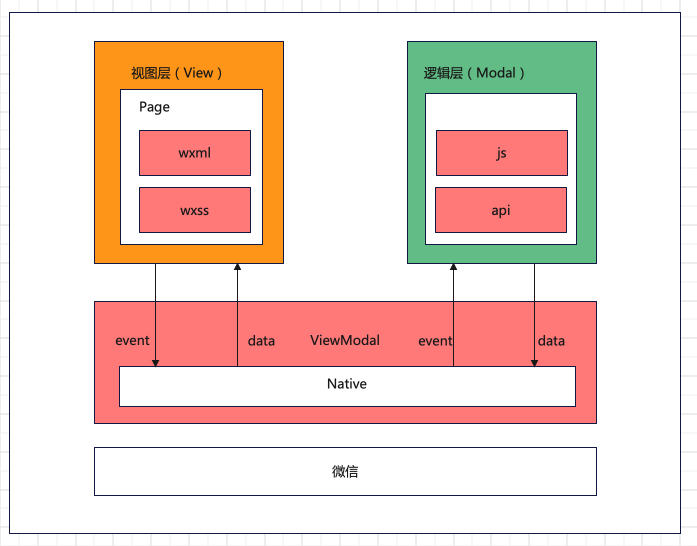
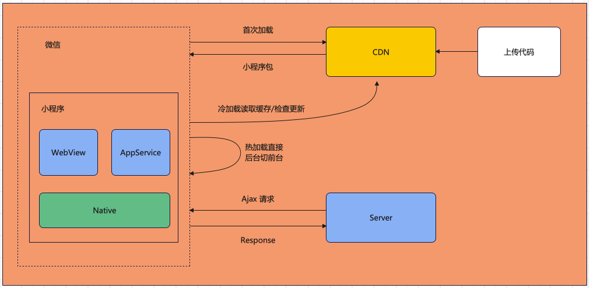
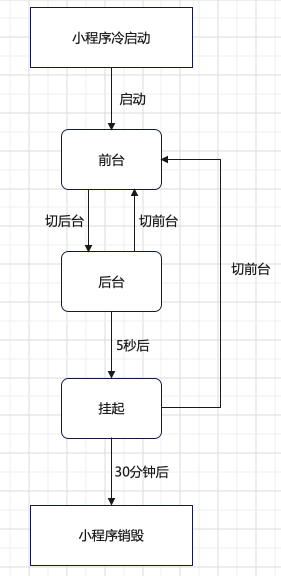
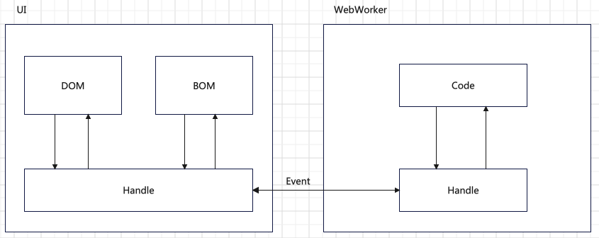

# 小程序初级

## 小程序的基础使用

### 1. 小程序介绍

⼩程序并⾮凭空冒出来的⼀个概念。当微信中的 WebView 逐渐成为移动 Web 的⼀个重要⼊⼝时，微信就有相关的JS-SDK 了。 JS-SDK 解决了移动⽹⻚能⼒不⾜的问题，通过暴露微信的接⼝使得 Web 开发者能够拥有更多的能⼒，然⽽在更多的能⼒之外，JS-SDK 的模式并没有解决使⽤移动⽹⻚遇到的体验不良的问题。

微信⾯临的问题是如何设计⼀个⽐较好的系统，使得所有开发者在微信中都能获得⽐较好的体验。这个问题是之前的 JS-SDK 所处理不了的，需要⼀个全新的系统来完成， 它需要使得所有的开发者都能 做到：

* 快速的加载 
* 更强⼤的能⼒ 
* 原⽣的体验 
* 易⽤且安全的微信数据开放
* ⾼效和简单的开发

小程序和H5的区别是什么呢？

* 运行环境：小程序是基于浏览器内核重构的解析器，而H5的宿主环境是浏览器，所以小程序中没有 DOM 和 BOM 的相关 API, JQuery 和一些 NPM（2.2.1版本前）包不能在小程序中使用。
* 系统权限：小程序能够获得更多的系统权限，如网络通信状态，数据缓存能力等。
* 渲染机制：小程序的逻辑层和渲染层是分开的，而H5页面 UI 渲染和 JavaScript 的脚本执行都在一个单线程中，互斥。所以H5页面中长时间的脚本运行可能会导致页面失去响应。

其实，小程序开发过程中，我们面对的是 IOS 和 Android 微信客户端和辅助开发的小程序开发者工具，根据官方文档，这三大运行环境也是有所区别的：

| 运行环境 | 逻辑层 | 渲染层 |
| :----: |:----: |:----: |
| ios | JavaScriptCore | WKWebView |
| Android | X5 JSCore | X5浏览器 |
| ⼩程序开发者⼯具 | NWJS | Chrome WebView |

### 2. 小程序的生命周期

关于小程序的生命周期，可以分为两个部分来理解：应用生命周期和页面生命周期。

<strong>应用的生命周期</strong>

1. 用户首次打开小程序，加载页面，触发 onLoad 事件。
2. ⼩程序初始化完成后，触发 onShow ⽅法，监听⼩程序显示。
3. ⼩程序从前台进⼊后台，触发 onHide ⽅法。
4. ⼩程序从后台进⼊前台显示，触发 onShow ⽅法。
5. ⼩程序后台运⾏⼀定时间，或系统资源占⽤过⾼，会被销毁。

<strong>页面的生命周期</strong>

1. ⼩程序注册完成后，加载⻚⾯，触发onLoad⽅法。
2. ⻚⾯载⼊后触发onShow⽅法，显示⻚⾯。
3. ⾸次显示⻚⾯，会触发onReady⽅法，渲染⻚⾯元素和样式，⼀个⻚⾯只会调⽤⼀次。
4. 当⼩程序后台运⾏或跳转到其他⻚⾯时，触发onHide⽅法。
5. 当⼩程序有后台进⼊到前台运⾏或重新进⼊⻚⾯时，触发onShow⽅法。
6. 当使⽤重定向⽅法wx.redirectTo()或关闭当前⻚返回上⼀⻚wx.navigateBack()，触发onUnload。

注意：应用生命周期会影响页面生命周期。

### 3. 小程序基础 api 及其页面结构

链接地址：https://developers.weixin.qq.com/miniprogram/dev/api/

### 4. 小程序的demo项目（代码）

### 5. 小程序架构 - 双线程模型

小程序的渲染层和逻辑层分别由2个线程进行管理：

* 渲染层：界面渲染相关的任务都是在 WebView 线程里面来执行。一个小程序存在多个界面，所以渲染层存在多个 WebView 线程。
* 逻辑层：采用 JsCore 线程来运行 JS 脚本。

视图层和逻辑层通过系统层的 WeixinJsBridage 进行通信，逻辑层把数据变化通知给视图层，触发视图层页面更新，视图层把触发的事件通知到逻辑层进行事件处理。

页面渲染的具体流程是：在渲染层，宿主环境会把 WXML 转化为对应的JS对象，在逻辑层发生数据变更的时候，我们需要通过宿主环境提供的setData方法把数据从逻辑层传递到渲染层，再通过对比前后差异，把差异应用在原来的DOM树上，渲染出真正的UI界面。

### 6. 运行机制

* 热启动：假如用户已经打开过某小程序，然后在一定时间内再次打开该小程序，此时无需重新启动，只需要将后台的小程序切换到前台，这个过程就是热启动。
* 冷启动：用户首次打开或者小程序被微信主动销毁后再次打开的情况，此时小程序需要重新加载启动，即冷启动。
* 销毁：只有当小程序进入后台一定时间，或者系统资源占用过高，才会被真正的销毁。

### 7. 自己实现一个简易版本的双线程模型

使用工具：Web Work + templateJS

* 事件驱动
* 安全的沙箱环境，不允许开发者直接访问DOM及某些有害api.

