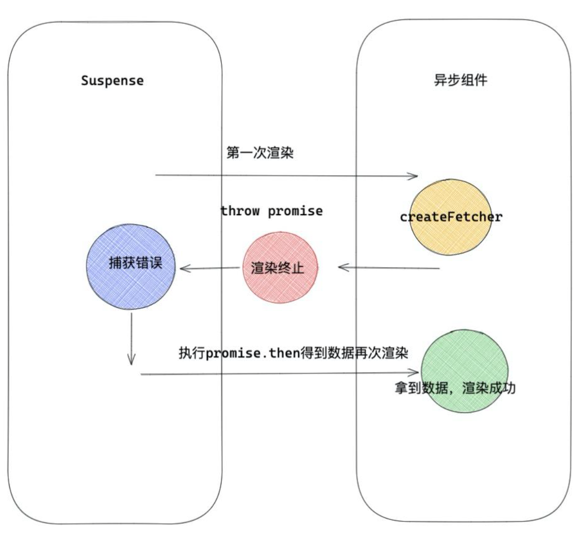

## React 高阶组件

### 高阶组件

1. 高阶函数的基本概念

* 函数可以作为参数被传递
* 函数可以作为返回值输出

```js
setTimeout(() => {
  console.log(1)
}, 1000)
```

```js
function foo(x) {
  return function() {
      return x;
  }
}
```

2. 高阶组件的基本概念


本质是利用一个函数，该函数接受 React 组件，并返回一个新的组件，一个组件经过一个函数之后变成了一个具有新的业务逻辑的组件。

```js
const NewComponent = higherOrderComponent(oldComponent)
```

* 高阶组件就是接受一个组件作为参数并返回一个新组建的函数。
* 高阶组件是一个函数，并不是一个组件。

具有的一些特点：

1. 一个函数，传入一个组件，返回一个新组件。
2. 一般不会有UI展现。
3. 提供一些可复用的功能。

3. TODO: 实例展示

4. 具体实践：

* 页面复用
* 权限控制
* 组件渲染性能跟踪

### React Hooks 带你进入函数组件的新世界

* Hooks 使命
* Hooks 原理
* Hooks 应用

#### Hooks使命

逻辑组件复用

* 逻辑与UI分离
React官方推荐在开发中将逻辑部分与视图部分解耦，便于定位问题和职责清晰。

* 函数组件拥有state
在函数组件中如果要实现类似拥有state的状态，必须要将组件转化为class组件。

* 逻辑组件复用
社区一直致力于逻辑层面的复用，像 render props/HOC，不过它们都有对应的问题，Hooks是目前为止相对完美的解决方案。

#### Hooks 解决什么问题？

render props

* 通过渲染props来实现逻辑组件复用。
* Avatar 组件是一个渲染头像的组件，里面包含其中一些业务逻辑，User组件是纯UI，展示用户名称。
* render props 通过嵌套组件实现，在真实的业务中，会出现嵌套多层，以及梳理 props 不清晰的问题。

```js
export default function App() {
    return (
        <div className="App">
        <Avatar name="头像">
            {name=> <User name={name} />}
        </Avatar>
    );
}
```


#### HOC 
* 通过对现有组件进行扩展、增强的方式来实现复用，通常采用包裹的方式来实现。
* 高阶组件的实现会额外的增加元素层级，使得页面元素的数量更加臃肿。


```js
import React, { Component } from "react";

class Avatar extends Component {
  render() {
    return <div>{this.props.name}</div>;
  }
}
function HocAvatar(Component) {
  return () => <Component name="头像" />;
}

export default HocAvatar(Avatar);
```

#### Hooks
* React 16.8 引入了Hooks，使得实现相同功能而代码量更少成为了现实。
* 通过使用 Hooks，不仅在硬编码层面减少了代码数量，同样的在编译之后的代码也会更少。

```js
import React, { useState } from "react";

export function HooksAvatar() {
  const [name, setName] = useState("头像");
  return <>{name}</>;
}
```

#### useState 源码解析

* useState API 虽然是在 react 中引入的，其内部实现是在 react-reconciler 包中完成。
* 在 try/catch 代码部分，调用了 mountState 方法。
* 顺着这个方法，我们去探寻一下 mountState 的实现。

```js
function useState<S>(initialState: S | (() => S)): [S, Dispatch<SetStateAction<S>>];
```

#### mountState 源码解析

mountState 方法内：
1. 先返回当前执行的 Hooks 对象，Hooks 对象包含 memoizedState/baseState/queue等属性。
2. 接下来会将下次要渲染的 state值和修改state方法返回。
3. 最后将这两个值以数组的形式返回。


* 在初始化的时，每一次申明 useState，就如图上所示，会生成一对state/setter映射，接着每次渲染都会按照这个序列从数组最小下标遍历到最大值。
* 在前面代码（mountState）中，我们说会返回一个 hooks 对象，state 值（memoizedState）和返回的 setXXX 都会关联到这个 hooks 对象。因此在触发某一个setXXX方法的时候可以正确的设置memoizedState值。

#### Hooks 官方API

* useState: 函数组件中的 state 方法。
* useEffect: 函数组件处理副作用的方法。
* userReducer: 另一种‘useState‘, 跟 Redux 有点类似。
* useCustom: 自定义Hooks组件。

#### 异步组件

传统模式：渲染组件 -> 请求数据 -> 再渲染组件
异步组件：请求数据 -> 渲染组件

开启Suspense模式

```js
function Index(){
    const [ userInfo , setUserInfo ] = React.useState(0)
    React.useEffect(()=>{
       /* 请求数据交互 */
       getUserInfo().then(res=>{
           setUserInfo(res)
       })
    },[])
    return <div>
        <h1>{userInfo.name}</h1>;
    </div>
}
export default function Home(){
    return <div>
        <Index />
    </div>
}
```

```js
function FutureAsyncComponent (){
    const userInfo = getUserInfo()
    return <div>
        <h1>{userInfo.name}</h1>; 
    </div>
}

/* 未来的异步模式 */
export default function Home(){
   return <div>
      <React.Suspense  fallback={ <div  > loading... </div> } >
          <FutureAsyncComponent/>
      </React.Suspense>
   </div>
}
```



模拟一个简单的Suspense

```js
export class Suspense extends React.Component{
   state={ isRender: true  }
   componentDidCatch(e){
     /* 异步请求中，渲染 fallback */
     this.setState({ isRender:false })
     const { p } = e
     Promise.resolve(p).then(()=>{
       /* 数据请求后，渲染真实组件 */
       this.setState({ isRender:true })
     })
   }
   render(){
     const { isRender } = this.state
     const { children , fallback } = this.props
     return isRender ? children : fallback
   }
}
```


#### React.lazy基本使用

```js
const LazyComponent = React.lazy(()=>import('./text'))
```

```js
const LazyComponent = React.lazy(() => import('./test.js'))

export default function Index(){
   return <Suspense fallback={<div>loading...</div>} >
       <LazyComponent />
   </Suspense>
}
```

```js
function Test(){
  return <div className="demo"  >hello world</div>
}
const LazyComponent =  React.lazy(()=> new Promise((resolve)=>{
  setTimeout(()=>{
      resolve({
          default: ()=> <Test />
      })
  },2000)
}))
```

```js
function lazy(ctor){
    return {
         $$typeof: REACT_LAZY_TYPE,
         _payload:{
            _status: -1,  //初始化状态
            _result: ctor,
         },
         _init:function(payload){
             if(payload._status===-1){ /* 第一次执行会走这里  */
                const ctor = payload._result;
                const thenable = ctor();
                payload._status = Pending;
                payload._result = thenable;
                thenable.then((moduleObject)=>{
                    const defaultExport = moduleObject.default;
                    resolved._status = Resolved; // 1 成功状态
                    resolved._result = defaultExport;/* defaultExport 为我们动态加载的组件本身  */ 
                })
             }
            if(payload._status === Resolved){ // 成功状态
                return payload._result;
            }
            else {  //第一次会抛出Promise异常给Suspense
                throw payload._result; 
            }
         }
    }
}
```

Suspense能解决什么？
* Suspense让数据获取库与 React 紧密整合。如果一个数据请求库实现了对 Suspense 的支持，那么，在 React 中使用 Suspense 将会是自然不过的事。
* Suspense能够自由的展现，请求中的加载效果。能让视图加载有更主动的控制权。
* Suspense能够让请求数据到渲染更流畅灵活，我们不用在componentDidMount请求数据，再次触发render，一切交给Suspense解决，一气呵成。


