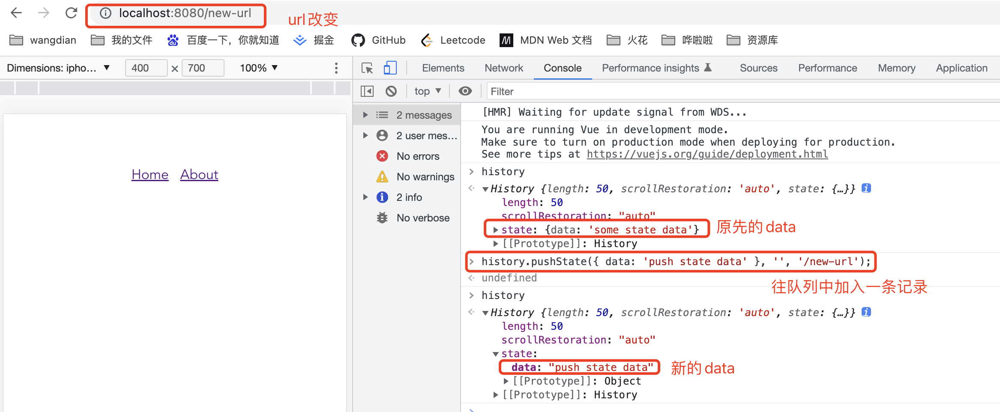

## React路由

### 本节课主题
vue-router 和 react-router 的实现原理解析
react-router 使用方式详解

### 底层核心原理

1. History 路由模式下，均基于 html5 新增的 history API，pushState，replaceState，其用法如下：

history.pushState(state, title, url);
history.replaceState(state, title, url);

即：跳转到 url 路径（与当前页面处在同一个域, 形如一个网站的 location.pathname 部分），指定新页面的标题 title，但是浏览器目前都忽略这个值，因此这里一般使用 null，state 为关联新地址的状态对象（刷新页面并不会丢失）。

二者的区别就是:
pushState 会增加一条浏览器记录，而 replaceState 会替换当前历史记录。

相同点是: 
均不会刷新当前页面，也不会发生真正的跳转，而是仅仅改变了地址栏的 URL（history、location 对象）


======================================

TODO: 自己补充的笔记

1. 关于 history.pushState() 

history.pushState() 是 JavaScript 中用于修改浏览器历史记录的方法。它可以在不刷新页面的情况下，通过修改 URL 并将新的状态添加到历史记录中。

history.pushState() 方法接受三个参数：state、title 和 url。

* state：一个 JavaScript 对象，表示要添加到历史记录的状态数据。这个对象可以包含任何您想要的数据。
* title：一个字符串，表示新的历史记录条目的标题。在大多数现代浏览器中，这个参数没有实际作用，可以传入一个空字符串。
* url：一个字符串，表示新的 URL。注意，这个 URL 是相对于当前页面的路径。

<strong>history.pushState 使用实例：</strong>

```JS
history.pushState({ data: 'some state data' }, '', '/new-url');
```

在上面的示例中，我们将一个带有 data 属性的对象添加到历史记录中，并将 URL 更改为 /new-url。

注意事项：

* history.pushState() 只会修改 URL，而不会触发页面的实际导航或加载。
* 在使用 history.pushState() 后，如果用户点击浏览器的后退按钮，将导航回上一个历史记录条目。
* 为了处理 popstate 事件，以便在用户点击后退按钮时进行相应的处理，您可以添加以下代码：
```js
window.addEventListener('popstate', event => {
  // 处理后退按钮事件的逻辑
  // event.state 包含了通过 pushState 设置的状态数据
});
```




2. 关于 history.replaceState()

history.replaceState() 是 JavaScript 中用于替换浏览器历史记录的方法。它类似于 history.pushState()，但是替换当前的历史记录条目，而不是添加一个新的。

history.replaceState() 方法也接受三个参数：state、title 和 url，与 history.pushState() 相同。

以下是 history.replaceState() 的使用示例：

```js
history.replaceState({ data: 'new state data' }, '', '/new-url');
```

在上面的示例中，我们将当前的历史记录条目替换为一个带有 data 属性的新状态，并将 URL 更改为 /new-url。

history.replaceState() 的注意事项与 history.pushState() 类似。它只会修改 URL 和当前历史记录条目的状态数据，而不会触发页面的实际导航或加载。使用 popstate 事件来处理后退按钮事件的逻辑也适用。

与 history.pushState() 相比，history.replaceState() 的一个常见应用场景是在进行某些操作后更新 URL，而不会添加新的历史记录条目。这在某些特定的应用程序场景中非常有用，例如在搜索结果页面进行筛选或排序时更新 URL。

======================================


2. Hash 路由模式下，基于 location.hash = pathString 来更新网站路径。
pathString 代表网址中 # 号后面直到 search 的部分。与 history 不同的是，如果两次赋值一样的时候，并不会触发 hashchange 和 popstate 方法。


3. 在非浏览器环境，使用抽象路由实现导航的记录功能，如 react-router 的 memoryHistory，vue-router 的 abstract 封装。


### vue-router 的使用方式

定义路由配置：在上面的代码中，我们创建了一个空的路由配置数组。您需要在这个数组中定义您的路由配置。每个路由配置都是一个对象，指定了路径（path）和要渲染的组件（component）

```js
// main.js
import Vue from 'vue'
import VueRouter from 'vue-router'
import App from './App.vue'

import Home from './components/Home'
import About from './components/About'

// Vue.config.productionTip = false
Vue.use(VueRouter)

const router = new VueRouter({
  mode: 'history',
  routes: [
    // 在这里定义您的路由配置
    {
      path: '/',
      component: Home
    },
    {
      path: '/about',
      component: About
    }
  ]
})

new Vue({
  router,
  render: h => h(App),
}).$mount('#app')

```

在应用中使用路由：现在，您已经创建了路由器实例并定义了路由配置，您可以在您的应用中使用路由了。在您的Vue组件中，可以使用<router-link>组件生成链接，以及使用<router-view>组件显示匹配到的组件。例如：

```js
// App.vue
<template>
  <div id="app">
    <router-link to="/">Home</router-link>&nbsp;&nbsp;
    <router-link to="/about">About</router-link>

    <!-- 在模板中使用路由视图 -->
    <router-view></router-view>
  </div>
</template>

<script>

export default {
  name: 'App',
  components: {}
}
</script>

<style>
</style>

```

### 如何注册使用一个全局组件？

第一步：
我们知道，Vue.use 方法接收一个实现了 install 方法的对象（或类）作为参数，例如注册一个全局组件 Modal，假设我们已经实现了 modal.vue

```vue
<template>
  <div class="modal">
    <div class="modal-content">
      <slot></slot>
    </div>
  </div>
</template>

<script>
export default {
  name: 'Modal'
  // 可以在这里定义组件的逻辑
};
</script>

<style scoped>
.modal {
  position: fixed;
  top: 0;
  left: 0;
  width: 100%;
  height: 100%;
  background-color: rgba(0, 0, 0, 0.5);
  display: flex;
  align-items: center;
  justify-content: center;
}

.modal-content {
  background-color: #fff;
  padding: 20px;
  border-radius: 4px;
}
</style>
```

第二步：在入口文件中注册 modal 组件：在Vue应用的入口文件（通常是 main.js）中，将 modal 组件全局注册为一个可复用的组件。例如：

```js
import Vue from 'vue'
import App from './App.vue'
import Modal from './components/Modal.vue'

Vue.component('modal', Modal)

new Vue({
  render: h => h(App)
}).$mount('#app')
```

第三步：使用modal组件：现在，您可以在整个应用程序的任何地方使用&lt;modal&gt;标签来引用全局注册的modal组件。例如，在Home.vue组件中使用：

```vue
<template>
  <div>
    this is Home page
    <button @click="showModal">Open Modal</button>
    <modal v-if="isModalVisible">
      <h2>Modal Content</h2>
      <p>This is the content of the modal.</p>
      
    </modal>
  </div>
</template>

<script>
export default {
  data() {
    return {
      isModalVisible: false
    };
  },
  methods: {
    showModal() {
      this.isModalVisible = true;
    }
  }
};
</script>

<style scoped>
</style>

```

在上面的示例中，我们使用<modal>标签来显示modal组件，并在按钮的点击事件中控制modal的显示与隐藏。


#### Vue-Router 源码分析

我们来看一下 node_modules/vue-router/src/router.js 下的 install

```js
import { install } from './install'
...
export default class VueRouter {
static install: () => void
...
}
VueRouter.install = install
```

下一步，看一下 install.js 的具体内容与实现

```js
import View from './components/view'
import Link from './components/link'

export let _Vue

export function install (Vue) {
  if (install.installed && _Vue === Vue) return
  install.installed = true

  _Vue = Vue

  const isDef = v => v !== undefined

  const registerInstance = (vm, callVal) => {
    let i = vm.$options._parentVnode
    if (isDef(i) && isDef(i = i.data) && isDef(i = i.registerRouteInstance)) {
      i(vm, callVal)
    }
  }

  Vue.mixin({
    beforeCreate () { // 这里使得 _route 属性具备响应能力
      if (isDef(this.$options.router)) {
        this._routerRoot = this
        this._router = this.$options.router
        this._router.init(this)
        Vue.util.defineReactive(this, '_route', this._router.history.current)
      } else {
        this._routerRoot = (this.$parent && this.$parent._routerRoot) || this
      }
      registerInstance(this, this)
    },
    destroyed () {
      registerInstance(this)
    }
  })

  Object.defineProperty(Vue.prototype, '$router', {
    get () { return this._routerRoot._router }
  })

  Object.defineProperty(Vue.prototype, '$route', {
    get () { return this._routerRoot._route }
  })

  // 走到下面两行代码已经水落石出了，这也是我们引入 vue-router 后
  // 就能全局使用 <router-view> 和 <router-link> 的原因
  Vue.component('RouterView', View)
  Vue.component('RouterLink', Link)

  const strats = Vue.config.optionMergeStrategies
  // use the same hook merging strategy for route hooks
  strats.beforeRouteEnter = strats.beforeRouteLeave = strats.beforeRouteUpdate = strats.created
}

```

不难得出结论，vue-router 是 Vue 应用的一个全局组件，一次注册便可以处处使用，且所有的 vue 实例都能访问到 Vue 原型对象上的 $router 和 $route 对象，因此在使用函数式跳转时是及其方便的.


继续往下看，在实例化 VueRouter 时，有 routes 和 mode 参数

```js
const router = new VueRouter({
  mode: 'history',
  routes: []
})
```

进入 VueRouter 的构造器 constructor

```js
constructor (options: RouterOptions = {}) {
  let mode = options.mode || 'hash'
  this.fallback = mode === 'history' && !supportsPushState && options.fallback !== false

  if (this.fallback) {
    mode = 'hash'
  }
  if (!inBrowser) {
    mode = 'abstract'
  }
  this.mode = mode

  switch (mode) {
    case 'history':
      this.history = new HTML5History(this, options.base)
      break
    case 'hash':
      this.history = new HashHistory(this, options.base, this.fallback)
      break
    case 'abstract':
      this.history = new AbstractHistory(this, options.base)
      break
    default:
      if (process.env.NODE_ENV !== 'production') {
        assert(false, `invalid mode: ${mode}`)
      }
  }
}
```

可以看出，基于三种 mode，vue-router 分别用三个对象来初始化 this.history：HTML5History，HashHistory，AbstractHistory

而后续的几类路由跳转（go, push...）方法，也是调用了 this.history 的方法。源码方面不再赘述。

### 根据原理实现一个简单的路由：

```vue
<script type="text/javascript">
  import Layout from './components/Layout.vue'
  import Home from './components/Home.vue'
  import About from './components/About.vue'
  import NoMatch from './components/404.vue'

  const routes = {
    '/home': Home,
    '/about': About,
  };

  export default {
    name: 'app',
    data() {
      return {
        activeRoute: location.pathname,
      }
    },
    computed: {
      computedView() {
        const Component = routes[this.activeRoute];
        return Component || NoMatch
      }
    },
    render(h) {
      return h(Layout, {}, [h(this.computedView)])
    }
  }
</script>
```

```vue
<template>
  <div>
    layout page
    <slot />
  </div>
   
</template>

<script>
export default {
}
</script>

<style scoped>
</style>
```

注意：layout.vue 里面一定要写这个 <slot />, 否则的话，你在路由后面添加的内容，无法显示出来，页面一直显示的是 layout page 这个内容，只有加上了插槽，对应路由页面的内容才会显示，比如 http://localhost:8080/home, 就会显示 home 页面的内容.

TODO: 待补充知识点
1. h函数
2. slot插槽使用及原理

### React-Router

#### 1. 如何使用 React-Router 进行路由跳转？

做一个简单的项目demo练习即可

#### 2. react-router和react-router-dom有什么区别？

React Router 是一个用于在 React 应用程序中实现路由功能的库。它提供了一组用于管理应用程序的 URL、导航和视图的组件和工具。

React Router 库分为两个主要的包：react-router 和 react-router-dom。

react-router：它是 React Router 库的核心包，提供了一些核心的路由组件和函数，如 Router、Route、Switch、Link、Redirect 等。它是平台无关的，可以在不同的环境中使用，包括 Web、React Native 等。

react-router-dom：它是基于 react-router 包的扩展，提供了适用于 Web 平台的额外功能和组件。它是在 Web 应用程序中使用 React Router 的推荐包，常用于构建基于浏览器的路由。

主要区别：

react-router-dom 需要依赖 react-router，因此在使用 react-router-dom 之前，你需要先安装 react-router。而 react-router 是平台无关的，可以在不同的环境中使用，包括 Web 和 React Native。

react-router-dom 提供了一些针对 Web 平台的额外组件，如 BrowserRouter、HashRouter、Link 等。这些组件是 react-router 的扩展，用于在浏览器环境中进行路由操作。

react-router-dom 还包括了一些特定于 Web 平台的功能，如浏览器历史记录管理、URL 解析等。

因此，如果你的项目是基于 Web 平台的 React 应用程序，通常建议使用 react-router-dom，因为它提供了更适合 Web 环境的功能和组件。如果你的项目需要在其他平台（如 React Native）上运行，你可以选择使用 react-router 或根据具体需求选择合适的库。


补充：
区别总结如下：

React Router 是整个 React Router 库的核心部分，提供了通用的路由功能和 API，适用于不同平台和环境。
React Router DOM 是适用于 Web 平台的 React Router 扩展库，提供了特定于 Web 的路由组件和 API，用于在 Web 应用程序中进行路由导航和渲染。
React Router DOM 包含在 React Router 中，因此在使用 React Router 时，你需要同时安装和导入 React Router 和 React Router DOM。

#### 3. react中如何使用context进行数据传递?

在 React 中，可以使用 Context API 进行组件之间的数据传递。Context 提供了一种在组件树中共享数据的方式，避免了通过 props 一层层传递数据的繁琐过程。以下是使用 Context 进行数据传递的基本步骤：

1. 创建一个 Context：首先，你需要创建一个 Context 对象，可以在一个单独的文件中完成。

```js
// MyContext.js
import React from 'react';

const MyContext = React.createContext();

export default MyContext;
```

2. 提供数据：在 Context 提供器中，将需要共享的数据传递给后代组件。

```js
// Parent.js
import React from 'react';
import ChildComponent from './ChildComponent';
import MyContext from './MyContext';

const Parent = () => {
  const sharedData = 'Hello from parent!';

  return (
    <MyContext.Provider value={sharedData}>
      {/* 渲染你的应用程序组件 */}
      <ChildComponent />
    </MyContext.Provider>
  );
};

export default Parent;
```

在上述代码中，我们使用 MyContext.Provider 组件将 sharedData 数据传递给后代组件。这里的 value 属性接受需要共享的数据。

3. 消费数据：在需要访问共享数据的组件中，使用 MyContext.Consumer 组件来访问数据。

```js
// ChildComponent.js
import React from 'react';
import MyContext from './MyContext';

const ChildComponent = () => {
  return (
    <MyContext.Consumer>
      {value => <div>{value}</div>}
    </MyContext.Consumer>
  );
};

export default ChildComponent;
```

在上述代码中，我们在 MyContext.Consumer 组件中使用一个函数作为子元素，该函数接收到共享数据，并在组件中进行使用。

另外，还可以使用 React 的 useContext 钩子来简化消费数据的过程。

```js
import React, { useContext } from 'react';
import MyContext from './MyContext';

const ChildComponent = () => {
  const value = useContext(MyContext);

  return <div>{value}</div>;
};

export default ChildComponent;
```

在上述代码中，我们使用 useContext 钩子来获取共享数据，并在组件中使用它。

这样，你就可以使用 Context 在 React 组件之间传递数据了。请记住，Context 应该根据需要进行合理使用，并避免过多地共享数据，以保持组件之间的隔离性和可重用性。


#### React-Router 和 React-Router-Dom 源码解析

TODO: 待补充