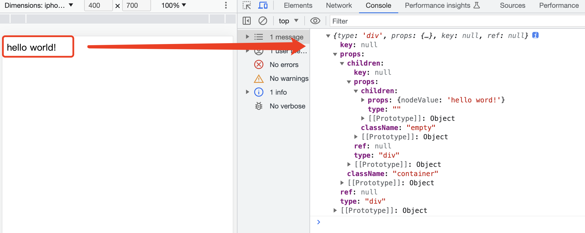
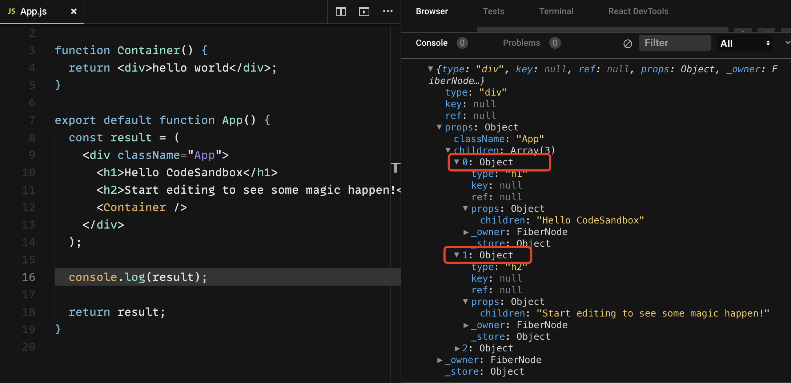
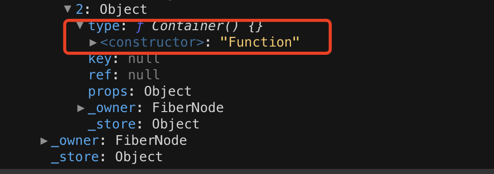
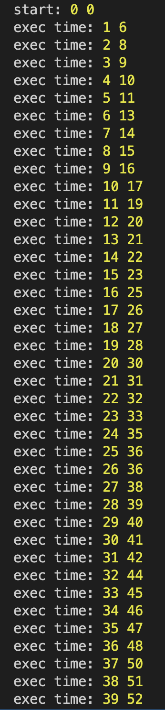
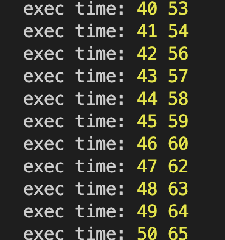

## React源码解析

### 一、createElement 实现 VNode

我们先来看一下下面的的这个dom结构

```js
<div class="div">hello word</div> 
```

我们知道，上面的这个dom结构，经过jsx的编译之后，会转化为下面的数据结构对象：

```js
{ type: 'div', props: { class: 'div', children: [{ type: '', props: {nodeValue: 'hello world!'}}]}}
```

那么，我们下面来做一件事情，我们通过自己手写代码，来实现将对应的 dom 结构转换为 VNode 对象。

第一步：我们先来实现一下 createElement 函数

```js
// 起名为 h函数，指代我们的 createElement 函数
export function h(type, props, ...kids) {
  props = props ?? {}
  kids = flatten(toArray(props.children ?? kids)).filter(Boolean)

  // 如果长度为1的话，说明react下面可以只有一个节点，props直接取数组里面的第一个对象，否则有多个节点的话，去取数组
  if (kids.length) {
    props.children = kids.length === 1 ? kids[0] : kids
  }

  const key = props.key ?? null
  const ref = props.ref ?? null

  delete props.key;
  delete props.ref;

  // h方法最终返回一个虚拟node节点, 返回的就是一个对象 
  return createVNode(type, props, key, ref)
}
```

下面我们分别来看一下，toArray 方法和 flatten 方法具体做了什么？

```js
const isArr = Array.isArray;
const toArray = arr => isArr(arr ?? []) ? arr : [arr];
const isText = txt => typeof txt === 'string' || typeof txt === 'number';
const flatten = arr =>
  [...arr.map(ar => isArr(ar)
    ? [...flatten(ar)]
    : isText(ar) ? createTextVNode(ar) : ar)]

// 创建文本的虚拟节点
function createTextVNode(text) {
  return {
    type: '',
    props: { nodeValue: text + '' }
  }
}
```

下面我们来看看 createVNode 这个函数里面具体做了什么？这就是我们要做的第二步，实现 createVNode 函数


第二步：实现 createVNode 函数

```js
// 创建虚拟节点
function createVNode(type, props, key, ref) {
  return {
    type,
    props,
    key,
    ref
  }
}
```

由上面的代码，我们可以知道，createVNode 最终返回了一个对象，也就是说，createElement 方法最终返回了一个虚拟node节点，返回的就是一个对象。


第三步：创建一个 index.html, 来验证一下我们所写的方法是否可以实现这个功能

```html
<!DOCTYPE html>
<html lang="en">
<head>
  <meta charset="UTF-8">
  <meta http-equiv="X-UA-Compatible" content="IE=edge">
  <meta name="viewport" content="width=device-width, initial-scale=1.0">
  <title>Document</title>
  <script type="module">
    import { h } from './index.js'

    console.log(
      h('div', 
        {className: 'container'},
        h('div', {className: 'empty'}, 'hello word!')
      )
    )
  </script>
</head>
<body>
    <div class="container">
      <div class="empty">
        hello world!
      </div>
    </div>
</body>
</html>
```

现在，我们已经完成了 index.html 文件的编码，可以看到，dom 里面包含了 container 和 empty 两个节点。

我们现在启动一个静态服务端口，看看最终的运行结果



由图片可见，最终生成了一个VNode节点，我们的代码正确的实现了功能（生成了一个VNode节点，是一个对象，有对应的层级结构）

问题：如果是嵌套组件的话，生成的组件形式又是什么样子的呢？

```js
// 嵌套组件代码
function Container() {
  return <div>hello world</div>;
}

export default function App() {
  const result = (
    <div className="App">
      <h1>Hello CodeSandbox</h1>
      <h2>Start editing to see some magic happen!</h2>
      <Container />
    </div>
  );

  console.log(result);

  return result;
}
```





可以看到，在上面的这个简单例子里面，最终结构的 props 的 children 里面包含了3个对象，前两个对象的 type 分别是 h1 和 h2. 第三个对象的 type 是 Container 函数。

### 二、scheduler(调度器)

#### 1. 基础概念 - 什么是调度器？

用来管理任务，按照一定的规则，将任务按照顺序进行执行输出。

#### 2. react 中 scheduler 中的相关知识了解

-  IDLE - requestIdleCallback

摘自MDN: window.requestIdleCallback() 方法插入一个函数，这个函数将在浏览器空闲时期被调用。这使开发者能够在主事件循环上执行后台和低优先级工作，而不会影响延迟关键事件，如动画和输入响应。函数一般会按先进先调用的顺序执行，然而，如果回调函数指定了执行超时时间timeout，则有可能为了在超时前执行函数而打乱执行顺序。

可以在空闲回调函数中调用 requestIdleCallback()，以便在下一次通过事件循环之前调度另一个回调。

简单来说，requestIdleCallback 就是用来执行 task 的，放到浏览器的空闲时间去执行，所有的任务，放到每一段的空闲时间去执行，切片处理。

问题：既然 requestIdleCallback 可以在浏览器的空闲时间进行调用，但是 React 的调度中为什么没有使用 requestIdleCallback？

两个原因：

* 1. 兼容性问题
* 2. 50ms优化问题（最本质的原因）（简单来说，50Hz, 1000/50=20ms，任务超过20ms没有执行完毕，就会让用户觉得卡顿）

#####  3. postMessage ？

为什么使用 messageChannel 而不使用其他的？

这里涉及到了 eventLoop -> 一句话解释 eventLoop（先执行宏任务，然后去看微任务队列里面有没有任务，清空微任务队列，再去执行下一个宏任务）

考点: 微任务是在 render 之前执行的，宏任务是在render 之后执行的。

提出疑问：setTimeout 也是宏任务，为什么没有选择？

原因：间隔时间不相等，越到后面，间隔时间都比较长，影响很多.

我们来写一个简单的例子，看一下时间

```js
let start = +new Date();
let count = 0;

console.log("start:", 0, 0)

function func() {
  setTimeout(() => {
    let execTime = +new Date();
    console.log('exec time:', ++count, execTime - start)
    if (count === 50) return
    func()
  })
}

func()
```





#### 4. 为什么为什么不使用generator去实现scheduler? 

原因：generator 内部是有状态的，中断了还得重新开始，很麻烦。

那为什么不使用 web worker?

web worker 属于结构化克隆（是深度克隆）（属于结构化克隆的有：web worker、history api）

### 三、scheduler

1. schedule -> 把任务放进一个队列，然后开始以某种节奏[ric(requestIdleCallback)]执行

    --> 还可以具体拆分为两步：pushTask（放进去）， schedule（执行）

2. shouldYield -> should yield -> generator yield（本质上，就是返回 true/false 的函数）

（向外界暴露一个方法，让外界知道知道是可以接着继续执行，还是终止）


#### 1. 简写大概流程

```js
const queue = [];
const threshold = 1000 / 60;

// git transtions
const transtions = [];
const deadline = 0; // 计时

const now = () => performance.now();
const peek = arr => arr[0];

export function shouldYield() {
  return navigator.scheduling.isInputPending() || now() >= deadline
}

// 触发一个宏任务，在nextTick里面把transtions里面的东西取出来跑一下
const postMessage = (() => {
  const cb = () => transtions.splice(0, 1).forEach(c => c());
  const { port1, port2 } = new MessageChannel();
  port1.onmessage = cb;
  return () => port2.postMessage(null)
})()


export function startTranstion(cb) {
  transtions.push(cb) && postMessage()
}

// 二合一， push/exec
export function scheduler(cb) {
  queue.push({ cb })
  startTranstion(flush)
}

function flush() {
  deadline = now() + threshold;
  let task = peek(queue); // 调和

  // 存在 task并且有时间
  while (task && !shouldYield()) {
    const { cb } = task;
    task.cb = null;
    const next = cb() // 把任务取出来

    if (next && typeof next === 'function') { // 如果任务是一个函数，更新任务 task 里面的回调函数
      task.cb = next
    } else { // 如果返回的是 null undefined，或者不是上面的函数，就认为任务是执行完毕的，直接清除任务
      // 清除任务
      queue.shift()
    }

    // 接着去清空队列
    task = peek(queue)
  }

  // 执行任务
  task && startTranstion(flush)

}
```

首先我们要知道 React 的 scheduler 是干什么的？ -> 作用：时间分片

那时间分片是怎么实现的呢？采用 requestIdleCallback，但是 react 为什么没有采用原生提供的window.requestIdleCallback 方法呢？

第一个原因：兼容性的问题
第二个原因：五十毫秒渲染的问题（也是最致命的原因）

大家可以现在就谷歌一下，直接搜索 requestIdleCallback 五十毫秒渲染优化，就可以搜索出很多关于这个问题的介绍，到这里我们就跳过了。

那么时间分片是什么意思？

简单来说，时间分片的目的，就是每隔一段时间就会把我的控制权（就是我不占用主线程让浏览器接着跑它的渲染）交出来，这样我的页面肯定就是很流畅的，不会发生卡顿。所以说 scheduler 的目的，说白了就是调度控制任务的进出，进出其实没有出，就是进和栈，然后接着执行，它就是控制这个东西，它是一个调度器，这点大家应该能够理解吧。所以说当它和 react 结合起来，就是说如果react 的组件状态发生更新了，这个时候就会去 scheduler 中加入一个任务，加入一个任务指的就是往队列里面 push 一个回调函数，然后 scheduler 里面就存入一个任务，其实这个任务就是我们刚才说的调和，最终会跑这个更新算法任务，

然后 scheduler 就会去调度这个任务，最终去执行这个 callback 任务。callback 其实说白了就是更新算法，React 在调和阶段更新了一个 fiber 了之后，它就会询问这个 scheduler，我应不应该要去暂停？如果我需要暂停的话，那我就去暂停。如果我不暂停的话，那我就接着继续执行下一个 fiber。

如果需要暂停，这个时候它就会返回一个函数，这个函数就是它下一次再接着执行的时候，他就会去执行这个函数，就是这一点，非常的关键。

以上就是总体的一个流程。

#### 2. 梳理一下整个过程

第一步，当 React 组件发生了更新的时候，就会有一个更新任务，就是涉及到调和，diff这种更新算法。可以简单的理解为是React 的更新任务，这个时候，我们就会把 React 的更新任务存在 scheduler 里面，其实就存在了一个队列里，就存了一下，这就是第一步。

第二步，在存进去了之后，scheduler 开始它的工作。scheduler 的任务就是进行调度，它调度的最终目标，就是有序有节奏的去执行存进来的这一堆更新任务，那么我们知道，它在执行的时候，是通过了一个叫做 shouldYield 这个方法, 往外界去暴露了一个信息，就是说当前你这个任务是可以接着继续跑还是你应该暂停，然后把控制权还给浏览器，不然浏览器就会卡，所以说就会有一个shouldYield 的方法。这个方法就很简单，返回了 true 或是 false, 因为就返回 true 或者 false 就可以向外界表示你这个方法是应该暂停，还是应该接着继续执行，

所以说步骤三是什么？如果这个 shouldYield 要是返回了一个 false, 也就说明当前浏览器的执行时间还是有空余的，你还是可以接着跑。然后这个时候呢，它就会继续执行他的任务。如果我这个 fiber 已经更新完了的话，我就肯定会更新下一个 fiber 上面的运行任务。这个 fiber 结束之后，我就会到下一个 fiber, 因为 fiber 是链表的形式，所以在这个时间段里面，它就去遍历这个链表就可以。但是如果这个东西返回了 true, 就告诉外界，你已经把我这一帧的时间耗完了，你最好 hold 住，然后等下一帧的时候，我有时间了，我再把时间分给你，你再去执行。

我们也不考虑优先级，假设大家都是高优先级，等到下一帧有时间了，再把时间分给你，你再接着跑。这个时候就有问题了，接着跑，那么跑的内容是什么呢？所以说就要求你在写这个 task 的时候，写法必须是固定的，如果你这个 task 是执行完了，你就 return 一个 undefined 或者是空 或者是其他的什么都行。如果你这个 task 没有执行完的话，你就 return 一个函数，接着继续跑。所以说等到了调度器里面的时候，调度器就可以根据你这个 task 的返回值来进行判断，如果是一个新的函数，那它就会再下一个时间片的时候接着跑，如果不是函数的话，那么就直接清除掉这个任务，所以说整体设计就是这样。

<strong>总结：</strong>

所以说，拆分出来的话就应该是两大步骤，第一步就是 scheduler，这个当然是我把放和执行合在一起，

如果 scheduler 拆开的话的，第一步就是 push, 第二步就是执行, 它执行的时候，就是去看这个执行返回的方法，看返回的一个方法，还是一个空或者是 undefined, 表示是否已经执行完毕。

第二步就是外界暴露一个 shouldYield 的方法，让外界知道知道是可以接着继续执行，还是终止。

整体就是这个流程。


