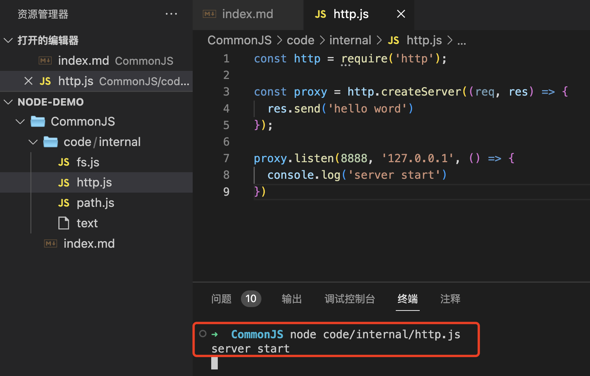
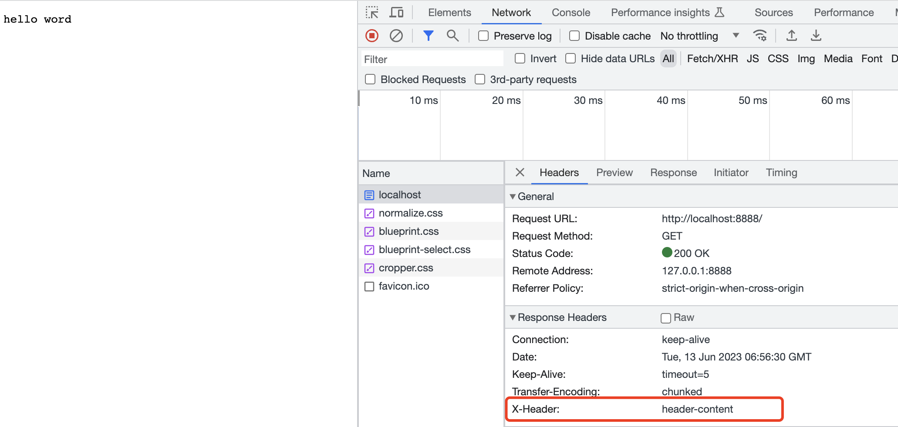

# nodejs实践

## 一、path模块

### 1. 例子一

```js
const path = require('path');

const resolvePath = path.resolve('a', 'b', 'c');
const joinPath = path.join('a', '..', 'b', 'c');

console.log(resolvePath)  // /Users/zhaoxin/Desktop/project/node-demo/a/b/c
console.log(joinPath)     // a/b/c
```

备注：resolve返回的是相对路径，join 只是把文件路径拼接在一起而已。

### 2. 例子二

```js
const path = require('path');

const resolvePath = path.resolve('a', '..', 'b', 'c');
const joinPath = path.join('a', '..', 'b', 'c');

console.log(resolvePath)  // /Users/zhaoxin/Desktop/project/node-demo/b/c
console.log(joinPath)     // b/c
```
 
备注：.. 代表的是到当前文件的上一级，所以会忽略掉a, 直接返回b和c

### 3. 例子三

```js
const path = require('path');

const resolvePath = path.resolve('a', '..', 'b', 'c/');
const joinPath = path.join('a', '..', 'b', 'c/');

console.log(resolvePath)  // /Users/zhaoxin/Desktop/project/node-demo/b/c
console.log(joinPath)     // b/c/
```

备注：

1. resolve 返回的是具体的路径，而join只是会把文件路径拼接在一起而已

2. 如果 const resolvePath = path.resolve('a', '..', 'b', 'c/c.js');
那么 此时返回的就是 /Users/zhaoxin/Desktop/project/node-demo/b/c/c.js

### 4. path.resolve 和 path.join 总结

相同点：
1. 都支持任意的参数，都可以在后面写任意的参数，最终都会通过内部的调用来拼接成为当前系统合法的路径。
2. 其次，他们都支持文件系统里面支持的内容，例如 ., ..等，当前路径或者是上一个目录，能够支持文件之间的依赖关系。

区别：

1. 路径问题

* join 方法比较纯粹，就是将所有参数进行一个拼接，进行返回一个合法路径，注意返回的是一个相对路径。
* resolve 比较实用，会把当前的参数拼接在绝对路径的后面，然后返回一个绝对路径。

2. 文件路径最后面是否需要加/

* resolve 会去看这个文件夹里面有没有文件，如果没有文件，路径直接省去最后面的/，如果有文件的话，才会去展示这个文件夹下面的文件，不省略最后面的/
* join 不管文件里面有没有内容，只要你在最后面写了/，就给你返回/。


在平时开发环境及其生产环境中，一般使用resolve, 返回绝对路径。


### 5. path 常见用法

require 对应的模块
module.exports 导出相应的模块
查看 __dirname, __filename

(require, module, exports, __dirname, _filename)

```js
const path = require('path');

const resolvePath = path.resolve('a', '..', 'b', 'c/');
const joinPath = path.join('a', '..', 'b', 'c/');

// __dirname: 查看文件夹
console.log(__dirname); 
// /Users/zhaoxin/Desktop/project/node-demo/CommonJS/code/internal

// __filename: 查看文件名称
console.log(__filename);
// /Users/zhaoxin/Desktop/project/node-demo/CommonJS/code/internal/path.js
```

```JS
const path = require('path');

const resolvePath = path.resolve('a', '..', 'b', 'c/');
const joinPath = path.join('a', '..', 'b', 'c/');

path.extname(__filename)
path.basename(__filename)
path.dirname(__filename)
```

## 二、fs模块

### 1. fs.readFile：异步读取文件，定义一个回调函数，不会阻塞

```js
const fs = require('fs');
const path = require('path');

// 读取文件
const pathToFile = path.resolve(__dirname, './text');

// 最后一个参数是function, function 里面有两个参数，一个是错误，一个是结果
fs.readFile(pathToFile, 'utf-8', function (err, result) {
  if (err) {
    console.log('error', err);
    return err;
  }

  console.log('result', result); // hello fs
})
```

如果读取一个不存在的文件，那么会发生什么？

hello文件在我们的文件夹里面并不存在，现在去读取这个文件下面的内容，运行下面的代码

```js
const fs = require('fs');
const path = require('path');

// 读取文件
const pathToFile = path.resolve(__dirname, './hello');

// 最后一个参数是function
fs.readFile(pathToFile, 'utf-8', function (err, result) {
  if (err) {
    console.log('error', err);
    return err;
  }

  console.log('result', result);
})
```

返回结果：

```js
error [Error: ENOENT: no such file or directory, open '/Users/zhaoxin/Desktop/project/node-demo/CommonJS/code/internal/hello'] {
  errno: -2,
  code: 'ENOENT',
  syscall: 'open',
  path: '/Users/zhaoxin/Desktop/project/node-demo/CommonJS/code/internal/hello'
}
```

结果：如果读取一个不存在的文件，会直接进行报错。


### 2. fs.readFileSync 同步读取文件，会阻塞执行，知道读取成功，才会接着继续执行。

```js
const fs = require('fs');
const path = require('path');

// 读取文件
const pathToFile = path.resolve(__dirname, './text');

const content = fs.readFileSync(pathToFile, 'utf-8')
console.log(content) // hello fs
```


### 3. 实现 promisify

```js
const fs = require('fs');
const path = require('path');

// 读取文件
const pathToFile = path.resolve(__dirname, './text');

function promisify(func) {
  return function (...args) {
    return new Promise((resolve, reject) => {
      args.push(function (err, result) {
        if (err) return reject(err)
        return resolve(result)
      });
      return func.apply(func, args)
    })
  }
}

const readFileAsync = promisify(fs.readFile)

readFileAsync(pathToFile, 'utf-8')
  .then(content => console.log(content))
  .catch(e => console.log(e))
```

最终读取到了text文件里面的内容： hello fs

## 三、http.js

### 1. 如何开启一个端口？

引入 http，使用 http.createServer， res.send 发送返回的请求

listen 监听端口

如下面的代码所示，我们使用 http.createServer创建了一个服务, 然后在请求头里面发送了一个内容 'x-header': 'header-content', 并且接口返回了一个 hello world内容。

我们监听8888端口，当看到 server start 出现的时候，说明我们的服务已经成功起来了。


```js
const http = require('http');
const proxy = http.createServer((req, res) => {
  res.writeHead(200, { 'x-header': 'header-content' })
  res.end('hello world')
});

proxy.listen(8888, '127.0.0.1', () => {
  console.log('server start')
})
```

启动方法， 进入到 http.js文件夹下面，使用 node http.js， 端口启动成功，显示server start，如下图所示



然后，我们便可以在浏览器里面输入 localhost:8888, 就可以看到我们的内容了


此时，我们打开 network, 就可以看见我们添加的 header




## 三、源码

### 1. vm

先来看一下下面的代码

```js
// index.js
var a = 123;

console.log('hello zhaoxin node', a + 1);
```

```js
// require.js
const vm = require('vm');
const path = require('path');
const fs = require('fs');


const pathToFile = path.resolve(__dirname, './index.js')
const content = fs.readFileSync(pathToFile, 'utf-8');

const script = new vm.Script(content, {
  filename: 'index.js'
})

const result = script.runInThisContext();

console.log(result)
// hello zhaoxin node 124
```

通过上的代码输出，我们正确的输出了 a+1 的值24。

这样我们就知道了，vm的作用，就是把一个字符串变成了一个可执行的代码。


### 2. 实现一个简单的 CommonJS

最终实现版本如下

```js
// index.js
require('./require')

const result = r('./module.js')

console.log(result)
```

```js
// require.js
const vm = require('vm');
const path = require('path');
const fs = require('fs');

function r(filename) {
  const pathToFile = path.resolve(__dirname, filename) // 读取文件名
  const content = fs.readFileSync(pathToFile, 'utf-8'); // 通过文件名，读取到文件内容字符串

  const wrapper = [
    '(function(require, module, exports) {',
    '})'
  ]

  // 包裹成为一个函数内容
  const wrappedContent = wrapper[0] + content + wrapper[1];

  const script = new vm.Script(wrappedContent, {
    filename: 'index.js'
  })

  const module = {
    exports: {}
  }

  const result = script.runInThisContext(); // 把字符串变成一个函数
  result(r, module, module.exports); // 把require, module, exports三个变量注入到函数里面
  return module.exports;
}

globalThis.r = r;
```

这个时候，我们运行 node index.js 命令，最终会打印出来 hello world, 说明我们的代码是可行的，我们这样就简单的实现了一个 commonjs

下面我们整体来梳理一下代码：

TODO: 根据代码补充

### 3. 经典面试题：commonjs 中 module.exports 和 export 的区别？

```js
const obj = {
  key: {}
}

// 两种改变key值的方式：

// 1. 直接赋值：
obj.key = 'hello world'

// console.log(obj); 
// 'hello world

// 2. 把obj.key赋值给一个变量，通过修改这个变量的属性进行赋值操作
var key = obj.key
key.key1 = 'hello world'

// console.log(obj); 
// { key: { key1: 'hello world' } }

```

问题：为什么不可以通过 key = 'hello world'的形式去修改 --> 没有改变引用，key值 不变

```js
const obj = {
  key: {}
}

var key = obj.key;

key = 'hello world';

console.log(obj);
// { key: {} }

// 没有改变引用，key值 不变
```

结论：

要么你通过 module.exports = xxx 去导出，要么你通过 exports.xx 去直接导出，你直接通过 exports = xx 是不可以的, 导出不出去


#### 4. commonjs 源码分析 (modules/cjs)

TODO: 代码分析待补充


### debug

