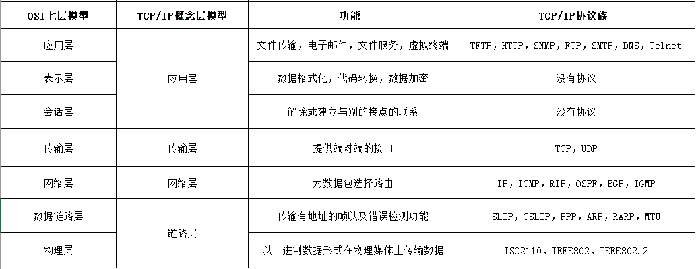
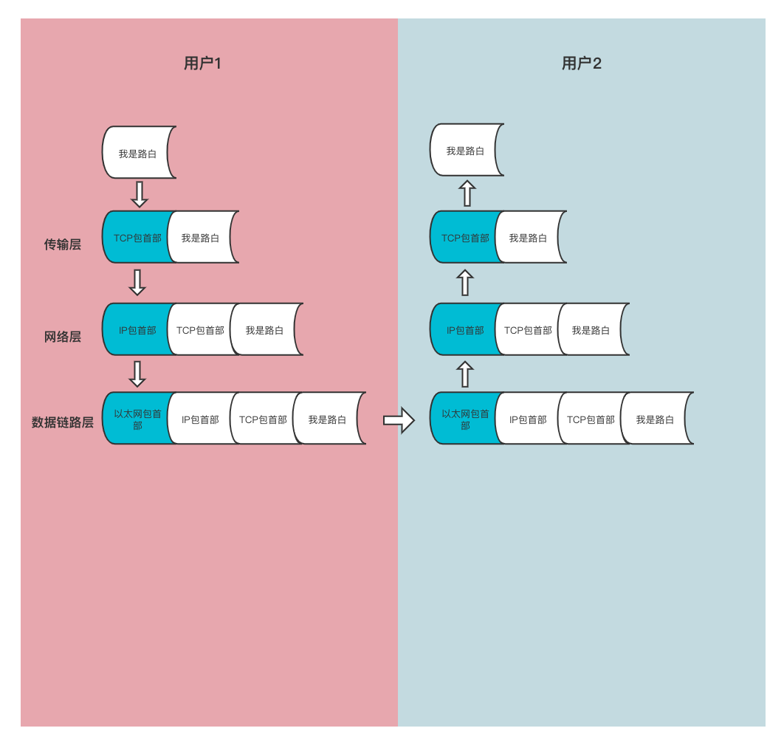
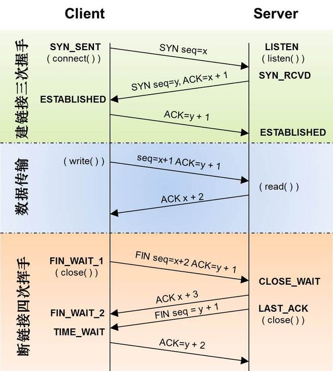

# nodejs网络 HTTP & 部署

## 一、网络

### TCP/IP 协议

在聊 TCP/IP 协议之前, 咱们先看⼀下 OSI 七层模型

* 第7层：应⽤层 为操作系统或⽹络应⽤程序提供访问⽹络服务的接⼝。应⽤层协议的代表包括： HTTP，HTTPS，FTP，TELNET，SSH，SMTP，POP3等。

* 第6层：表示层 把数据转换为接受者能够兼容并且适合传输的内容，⽐如数据加密，压缩，格式转换等。

* 第5层：会话层 负责数据传输中设置和维持⽹络设备之间的通信连接。管理主机之间的会话进程，还可以利⽤在数据中插⼊校验点来实现数据的同步。

* 第4层：传输层 把传输表头加⾄数据形成数据包，完成端到端的数据传输。传输表头包含了协议等信息，⽐如: TCP，UDP 等。

* 第3层：⽹络层 负责对⼦⽹间的数据包进⾏寻址和路由选择，还可以实现拥塞控制，⽹际互联等功能。⽹络层的协议包括：IP，IPX 等。⽐如路由器就在这

* 第2层：数据链路层 在不可靠的物理介质上提供可靠的传输，主要主要为：物理地址寻址、数据封装成帧、流量控制、数据校验、重发等。⽐如交换机就在这。

* 第1层：物理层 在局域⽹上传送数据帧，负责电脑通信设备与⽹络媒体之间的互通，包括针脚，电压，线缆规范，集线器，⽹卡，主机适配等。

1. 牛客网的视频面试，底层采用的是什么协议？ -> TCP or UDP -> answer is UDP协议

2. 路由器在哪一层？ -> 网络层

3. html在哪一层？ -> 应用层

4. 协议是什么？

通俗点说：协议定义了每⼀层的作⽤是什么, 每⼀层的职责是什么, 类似于规范和约束.

5. TCP/IP网络协议具体是指什么？

有的⽂章⾥就是具体指的TCP协议和IP协议, 但是⼤多数时候提到的TCP/IP协议, 可以理解为互联⽹通信所需要的协议, 是⼀个协议家族, 以TCP、IP协议为核⼼, 包含HTTP、SMTP、TELNET 等各种协议。

6. TCP/IP参考模型?

TCP/IP参考模型是⼀个抽象的分层模型，这个模型中，所有的TCP/IP系列⽹络协议都归类到4个抽象的“层”中.

可以看⼀下图 assets/OSI和TCPIP概念模型.png



7. 数据包

数据包是⽹络层及以上分层中包的单位。

每个分层都会对发送的数据添加⼀个⾸部, ⾸部包含了该层协议相关的信息, ⽽真正要发送的内容称之为数据。

首部 + 数据 =  数据包

⽽对于下层来说, 上层发送过来的全部内容, 都会当做本层的数据, 举个例⼦：

传输层 TCP包：TCP包⾸部 + 数据
⽹络层 IP包：IP包⾸部 + (TCP包⾸部 + 数据)
数据链路层 以太⽹包：以太⽹包⾸部 + (IP包⾸部 + (TCP包⾸部 + 数据))

这⾥可以看图 assets/TCP_IP_数据包.png



8. 每层在接收到数据后除了添加⾸部, 还要做什么呢?

用户1

* 传输层：通过添加TCP⾸部，来保证数据的可靠传输
* ⽹络层：IP包⽣成后，参考路由控制表，决定接受此IP包的路由或主机。
* 数据链路层：⽣成的以太⽹数据包将通过物理层传输给接收端

用户2

* 数据链路层：主机收到以太⽹包后，⾸先从以太⽹包⾸部找到 MAC 地址判断是否为发送给⾃⼰的包，若不是则丢弃数据。
  如果是发送给⾃⼰的包，则从以太⽹包⾸部中的类型确定数据类型，再传给相应的模块，⽐如IP.
* ⽹络层：从包⾸部中判断此 IP 地址是否与⾃⼰的 IP 地址匹配，如果匹配则根据⾸部的协议类型将数据发送给对应的模块，⽐如TCP
* 传输层：在 TCP 模块中，⾸先会计算⼀下校验和，判断数据是否被破坏。然后检查是否在按照顺序接收数据。最后检查端⼝号，确定具体的应⽤程序。数据被完整地接收以后，会传给由端⼝号识别的应⽤程序。

总结⼀下⼏个地址：

* 数据链路层的是MAC地址, ⽤来识别同⼀链路中的不同计算机
* ⽹络层的是IP地址, ⽤来识别TCP/IP ⽹络中互连的主机和路由器
* 传输层的是端⼝号(程序地址), ⽤来识别同⼀台计算机中进⾏通信的不同应⽤程序


9. 我们通过这三个地址，就可以识别一次通信了吗？

答案是否定的。

我们需要通过以下这⼏个数据综合来识别⼀次通信：

* IP⾸部：源IP地址
* IP⾸部：⽬标IP地址
* 协议号, TCP或者UDP
* TCP⾸部：源端⼝号
* TCP⾸部：⽬标端⼝号

10. TCP？UDP的区别？应用场景？

* UDP是⽆连接的，TCP必须三次握⼿建⽴连接
* UDP是⾯向报⽂，没有拥塞控制，所以速度快，适合多媒体通信要求，⽐如及时聊天，⽀持⼀对⼀，⼀队多。多对⼀，多对多。就像⽜客⽹的视频⾯试就是⽤的UDP
* TCP只能是⼀对⼀的可靠性传输

那么咱们的直播底层是什么协议呢?

其实现在常⻅的 rtmp 和 hls 直播, 都是基于TCP的, 希望能提供稳定的直播环境.

11. TCP是通过什么方式提供可靠性的？

* 超时重发，发出报⽂段要是没有收到及时的确认，会重发。
* 数据包的校验，也就是校验⾸部数据和。
* 对失序的数据重新排序
* 进⾏流量控制，防⽌缓冲区溢出
* 快重传和快恢复
* TCP会将数据阶段为合理的长度

12. TCP如何控制拥塞？

拥塞控制就是防⽌过多的数据注⼊⽹络中，这样可以使⽹络中的路由器或链路不致过载。

发送⽅维持⼀个叫做拥塞窗⼝cwnd（congestion window）的状态变量。

为了防⽌cwnd增⻓过⼤引起⽹络拥塞，还需设置⼀个慢开始⻔限ssthresh状态变量。ssthresh 的⽤法如下：

当cwnd < ssthresh时，使⽤慢开始算法。也就是乘法算法
当cwnd > ssthresh时，改⽤拥塞避免算法。也就是加法算法
当cwnd = ssthresh时，慢开始与拥塞避免算法任意

当出现拥塞的时候就把⼼的⻔限值设为此时窗⼝⼤⼩的⼀般，窗⼝⼤⼩设置为1，再重新执⾏上⾯的步骤。
当收到连续三个重传的时候这就需要快重传和快恢复了，当收到连续三个重传，这个时候发送⽅就要重传⾃⼰的信息，然后⻔限减半但是这个时候并不是⽹络阻塞，窗⼝只会减半执⾏拥塞避免算法。

13. TP协议的一次数据传输，从建立连接到断开连接都有哪些过程？

可以看⼀下图 assets/TCP数据传输流程.jpeg



<strong>三次握手</strong>

第⼀次握⼿：建⽴连接。客户端发送连接请求报⽂段，将SYN位置为1，Sequence Number为 x；然后，客户端进⼊SYN_SEND状态，等待服务器的确认；

第⼆次握⼿：服务器收到客户端的SYN报⽂段，需要对这个SYN报⽂段进⾏确认，设置 Acknowledgment Number为x+1(Sequence Number+1)；同时，⾃⼰⾃⼰还要发送SYN请求信息，将SYN位置为1，Sequence Number为y；服务器端将上述所有信息放到⼀个报⽂段（即SYN+ACK报⽂段）中，⼀并发送给客户端，此时服务器进⼊SYN_RECV状态；

第三次握⼿：客户端收到服务器的SYN+ACK报⽂段。然后将Acknowledgment Number设置为y+1，向服务器发送ACK报⽂段，这个报⽂段发送完毕以后，客户端和服务器端都进⼊ESTABLISHED状态，完成TCP三次握⼿。

完成了三次握⼿，客户端和服务器端就可以开始传送数据。以上就是TCP三次握⼿的总体介绍。

通信结束客户端和服务端就断开连接，需要经过四次分⼿确认。

<strong>四次挥手</strong>

第⼀次分⼿：主机1（可以使客户端，也可以是服务器端），设置Sequence Number和Acknowledgment Number，向主机2发送⼀个FIN报⽂段；此时，主机1进⼊FIN_WAIT_1状态；这表示主机1没有数据要发送给主机2了；

第⼆次分⼿：主机2收到了主机1发送的FIN报⽂段，向主机1回⼀个ACK报⽂段，Acknowledgment Number为Sequence Number加1；主机1进⼊FIN_WAIT_2状态；主机2告诉主机1，我“同意”你的关闭请求；

第三次分⼿：主机2向主机1发送FIN报⽂段，请求关闭连接，同时主机2进⼊LAST_ACK状态；

第四次分⼿：主机1收到主机2发送的FIN报⽂段，向主机2发送ACK报⽂段，然后主机1进⼊TIME_WAIT状态；主机2收到主机1的ACK报⽂段以后，就关闭连接；此时，主机1等待2MSL后依然没有收到回复，则证明Server端已正常关闭，那好，主机1也可以关闭连接了。


14. IP地址

<strong>IPv4</strong>

IPv4： 由32位正整数来表示, 二进制

IP 地址（IPv4 地址）由32位正整数来表示，在计算机内部以⼆进制⽅式被处理。⽇常⽣活中，我们将32位的 IP 地址以每8位为⼀组，分成4组，每组以 “.” 隔开，再将每组数转换成⼗进制数.

IP地址包含⽹络标识和主机标识, ⽐如172.112.110.11

172.112.110就是⽹络标识, 同⼀⽹段内⽹络标识必须相同
11就是主机标识, 同⼀⽹段内主机标识不能重复


<strong>IPv6</strong>

IPv6（IP version 6）是为了根本解决 IPv4 地址耗尽的问题⽽被标准化的⽹际协议。IPv4 的地址⻓度为 4 个 8 位字节，即 32 ⽐特。⽽ IPv6 的地址⻓度则是原来的 4 倍，即 128 ⽐特，⼀般写成 8 个 16 位字节。

15. DNS

我们平时访问⼀个⽹站, ⼀个应⽤程序, 并不是⽤ip来访问的, ⽽是⽤⼀个域名. 那么域名是怎么和ip地址建⽴联系的呢?

就是通过dns, Domain Name System. ⽐如wiki上的⼀个例⼦

以访问 zh.wikipedia.org 为例：

* 客户端：query zh.wikipedia.org => DNS服务器(如果存在记录则直接返回结果)
* DNS服务器 => 根域名服务器(返回顶级域 .org的服务器地址)
* DNS服务器 => .org的顶级域名服务器（返回 .wikipedia.org 的权威域名服务器地址）
* DNS服务器 => .wikipedia.org 的权威域名服务器地址。（返回 zh.wikipedia.org的记录）=> 客户端

客户端发送查询报⽂”query zh.wikipedia.org”⾄DNS服务器，DNS服务器⾸先检查⾃身缓存，如果存在记录则直接返回结果。
如果记录⽼化或不存在，则：
DNS服务器向根域名服务器发送查询报⽂”query zh.wikipedia.org”，根域名服务器返回顶级域 .org 的顶级域名服务器地址。
DNS服务器向 .org 域的顶级域名服务器发送查询报⽂”query zh.wikipedia.org”，得到⼆级域 .wikipedia.org 的权威域名服务器地址。
DNS服务器向 .wikipedia.org 域的权威域名服务器发送查询报⽂”query zh.wikipedia.org”，得到主机 zh 的A记录，存⼊⾃身缓存并返回给客户端。


### 二、如何通过Nodejs来创建一个TCP服务？

在这之前咱们要先来了解⼀下Socket的概念。

我们经常把socket翻译为套接字，socket是在应⽤层和传输层之间的⼀个抽象层，它把TCP/IP层复杂的操作抽象为⼏个简单的接⼝供应⽤层调⽤已实现进程在⽹络中通信, ⽐如create，listen，accept，connect，read和write等等。

node⾥有各种⽹络相关的模块, http为应⽤层模块，主要按照特定协议编解码数据；net为传输层模块，主要负责传输编码后的应⽤层数据；https是个综合模块（涵盖了http/tls/crypto等），主要⽤于确保数据安全性。

1. 创建tcp服务端

```js
const net = require('net');
const HOST = '127.0.0.1';
const PORT = 7777;
// 创建⼀个TCP服务器实例，调⽤listen函数开始监听指定端⼝
// net.createServer()有⼀个参数, 是监听连接建⽴的回调
net.createServer((socket) => {
  const remoteName = `${socket.remoteAddress}:${socket.remotePort}`;
  // 建⽴成功了⼀个连接, 这个回调函数⾥返回⼀个socket对象.
  console.log(`${remoteName} 连接到本服务器`);
  // 接收消息
  socket.on('data', (data) => {
    console.log(`${remoteName} - ${data}`)
    // 给客户端发消息
    socket.write(`你刚才说啥？是${data}吗？`);
  });
  // 关闭
  socket.on('close', (data) => {
    console.log(`${remoteName} 连接关闭`)
  });
}).listen(PORT, HOST);
console.log(`Server listening on ${HOST}:${PORT}`);
```

2. 创建tcp客户端

```js
const net = require('net');
const HOST = '127.0.0.1';
const PORT = 7777;
const client = new net.Socket();
const ServerName = `${HOST}:${PORT}`;
let count = 0;
client.connect(PORT, HOST, () => {
  console.log(`成功连接到 ${ServerName}`);
  // 向服务端发送数据
  const timer = setInterval(() => {
    if (count > 10) {
      client.write('我没事了, 告辞');
      clearInterval(timer);
      return;
    }
    client.write('⻢冬梅' + count++);
  }, 1000)
});
// 接收消息
client.on('data', (data) => {
  console.log(`${ServerName} - ${data}`);
  // 关闭连接
  // client.destroy();
});

// 关闭事件
client.on('close', () => {
  console.log('Connection closed');
});
client.on('error', (error) => {
  console.log(error);
})
```

3. 运⾏⼀下

```node tcp-server.js```

```node tcp-client.js```


## 三、如何使⽤NodeJs来创建⼀个UDP服务?

1. 创建udp服务端

```js
const dgram = require('dgram');
const server = dgram.createSocket('udp4');
server.on('message', (msg, remote) => {
  console.log(`${remote.address}:${remote.port} - ${msg}`)
  server.send(`收到！`, remote.port, remote.address);
})
server.on('listening', () => {
  const address = server.address()
  console.log(`Server listening on ${address.address}:${address.port}`);
})
server.bind(44444);
```

2. 创建udp客户端

```js
const dgram = require('dgram')
const message = Buffer.alloc(5, 'lubai')
const client = dgram.createSocket('udp4')
client.send(message, 0, message.length, 44444, 'localhost',
  (err, bytes) => {
    console.log(`发送成功${bytes}字节`);
    // client.close()
  })
client.on('message', (buffer) => {
  console.log(buffer.toString())
})
```

3. 运⾏⼀下

```node udp-server.js```

```node udp-client.js```

## 四、HTTP

HTTP协议（HyperText Transfer Protocol，超⽂本传输协议）是⽤于从WWW服务器传输超⽂本到本地浏览器的传输协议。它可以使浏览器更加⾼效，使⽹络传输减少。它不仅保证计算机正确快速地传输超⽂本⽂档，还确定传输⽂档中的哪⼀部分，以及哪部分内容⾸先显示(如⽂本先于图形)等。

HTTP是客户端浏览器或其他程序与Web服务器之间的应⽤层通信协议。在Internet上的Web服务器上存放的都是超⽂本信息，客户机需要通过HTTP协议传输所要访问的超⽂本信息。HTTP包含命令和传输信息，不仅可⽤于Web访问，也可以⽤于其他因特⽹/内联⽹应⽤系统之间的通信，从⽽实现各类应⽤资源超媒体访问的集成。

我们在浏览器的地址栏⾥输⼊的⽹站地址叫做URL (Uniform Resource Locator，统⼀资源定位符)。就像每家每户都有⼀个⻔牌地址⼀样，每个⽹⻚也都有⼀个Internet地址。当你在浏览器的地址框中输⼊⼀个URL或是单击⼀个超级链接时，URL就确定了要浏览的地址。浏览器通过超⽂本传输协议(HTTP)，将Web服务器上站点的⽹⻚代码提取出来，并翻译成漂亮的⽹⻚。

### ⼀次完整的HTTP通信是什么样⼦的?

1. 建⽴ TCP 连接

   在HTTP⼯作开始之前，客户端⾸先要通过⽹络与服务器建⽴连接，该连接是通过 TCP 来完成的。HTTP 是⽐ TCP 更⾼层次的应⽤层协议，根据规则，只有低层协议建⽴之后，才能进⾏⾼层协议的连接，因此，⾸先要建⽴ TCP 连接，⼀般 TCP 连接的端⼝号是80；

2. 客户端向服务器发送请求命令

   ⼀旦建⽴了TCP连接，客户端就会向服务器发送请求命令；
   例如：GET/info HTTP/1.1

3. 客户端发送请求头信息

   客户端发送其请求命令之后，还要以头信息的形式向服务器发送⼀些别的信息，之后客户端发送了⼀空⽩⾏来通知服务器，它已经结束了该头信息的发送；

4. 服务器应答

   客户端向服务器发出请求后，服务器会客户端返回响应；
   例如： HTTP/1.1 200 OK
   响应的第⼀部分是协议的版本号和响应状态码

5. 服务器返回响应头信息
    正如客户端会随同请求发送关于⾃身的信息⼀样，服务器也会随同响应向⽤户发送关于它⾃⼰的数据及被请求的⽂档；

6. 服务器向客户端发送数据
   服务器向客户端发送头信息后，它会发送⼀个空⽩⾏来表示头信息的发送到此为结束，接着，它就以 Content-Type 响应头信息所描述的格式发送⽤户所请求的实际数据；

7. 服务器关闭 TCP 连接
   ⼀般情况下，⼀旦服务器向客户端返回了请求数据，它就要关闭 TCP 连接，然后如果客户端或者服务器在其头信息加⼊了这⾏代码 Connection:keep-alive ，TCP 连接在发送后将仍然保持打开状态，于是，客户端可以继续通过相同的连接发送请求。保持连接节省了为每个请求建⽴新连接所需的时间，还节约了⽹络带宽。


#### HTTP协议有哪些特点?

1. 通过请求和响应的交换达成通信

协议规定, 请求从客户端发出, 服务端响应请求并返回.

2. ⽆状态

HTTP 是⼀种⽆状态协议, 在单纯HTTP这个层⾯，协议对于发送过的请求或响应都不做持久化处理

3. 使⽤Cookie做状态管理

服务端返回的头信息上有可能会携带Set-Cookie, 那么当客户端接收到响应后, 就会在本地种上cookie. 在下⼀次给服务端发送请求的时候, 就会携带上这些cookie。

4. 通过URL定位资源

这⾥区分⼀下URI和URL的概念.

URI: 统⼀资源标识符, ⽐如你身份证号是xxxxxxx, 在所有⼈中是独⼀⽆⼆的, 这个身份证号就能标识你的身份, 那么它就是URI
URL: 统⼀资源定位符, ⽐如北京市/朝阳区/xxxx/xxxx/xxxxx, 通过这⼀串信息可以定位到你, 那么这个就是URL

URL有点类似于通过定位实现的URI.

就像有个⽗类叫做URI, 他要实现的是唯⼀确定⼀个id. 有的⼈喜欢继承URI, 通过location来实现; 有的⼈喜欢继承URI, 通过name来实现.

5. 通过各种⽅法来标识⾃⼰的意图

这⾥指的是各种HTTP⽅法, ⽐如GET POST PUT DELETE等.

6. 持久连接

HTTP 协议的初始版本中，每进⾏⼀个 HTTP 通信都要断开⼀次 TCP 连接，增加了很多没必要的建⽴连接的开销。

为了解决上述 TCP 连接的问题，HTTP/1.1 ⽀持持久连接。其特点是，只要任意⼀端没有明确提出断开连接，则保持 TCP 连接状态。旨在建⽴⼀次 TCP 连接后进⾏多次请求和响应的交互。在 HTTP/1.1 中，所有的连接默认都是持久连接。

也就是说默认情况下建⽴ TCP 连接不会断开，只有在请求报头中声明 Connection: close 才会在请求完成后关闭连接。

7. 管道机制

1.1版本引⼊pipelining机制, 即在同⼀个TCP连接⾥⾯，客户端可以同时发送多个请求。

举例来说，客户端需要请求两个资源。以前的做法是，在同⼀个TCP连接⾥⾯，先发送A请求，然后等待服务器做出回应，收到后再发出B请求。管道机制则是允许浏览器同时发出A请求和B请求，但是服务器还是按照顺序，先回应A请求，完成后再回应B请求。

但是现代浏览器⼀般没开启这个配置, 这个机制可能会造成队头阻塞. 因为响应是有顺序的, 如果⼀个TCP连接中的第⼀个HTTP请求响应⾮常慢, 那么就会阻塞后续HTTP请求的响应.

所以现实中默认情况下, ⼀个TCP连接同⼀时间只发⼀个HTTP请求.

有的同学会问, 我怎么听说chrome最⼤⽀持6个同域名请求呢？ ---> 那是因为chrome最⼤⽀持同时开启6个TCP连接。


#### 那么HTTP 1.0/1.1/2.0在并发请求上主要区别是什么?

1. HTTP/1.0

每次TCP连接只能发送⼀个请求，当服务器响应后就会关闭这次连接，下⼀个请求需要再次建⽴TCP连接. 

2. HTTP/1.1

默认采⽤持续连接(TCP连接默认不关闭，可以被多个请求复⽤，不⽤声明Connection: keep-alive).

增加了管道机制，在同⼀个TCP连接⾥，允许多个请求同时发送，增加了并发性，进⼀步改善了HTTP协议的效率，

但是同⼀个TCP连接⾥，所有的数据通信是按次序进⾏的。回应慢，会有许多请求排队，造成”队头堵塞”。

3. HTTP/2.0

加了双⼯模式，即不仅客户端能够同时发送多个请求，服务端也能同时处理多个请求，解决了队头堵塞的问题。

使⽤了多路复⽤的技术，做到同⼀个连接并发处理多个请求，⽽且并发请求的数量⽐HTTP1.1⼤了好⼏个数量级。

增加服务器推送的功能，不经请求服务端主动向客户端发送数据。

#### 各种Headers

Cache-Control
通过指定⾸部字段 Cache-Control 的指令，就能操作缓存的⼯作机制。

1. Cache-Control: public

当指定使⽤ public 指令时，则明确表明其他⽤户也可利⽤缓存。

2. Cache-Control: private

当指定 private 指令后，响应只以特定的⽤户作为对象，这与 public 指令的⾏为相反。缓存服务器会对该特定⽤户提供资源缓存的服务，对于其他⽤户发送过来的请求，代理服务器则不会返回缓存。

3. Cache-Control: no-cache

可以在客户端存储资源，每次都必须去服务端做过期校验，来决定从服务端获取新的资源（200）还是使⽤客户端缓存（304）。也就是所谓的协商缓存。

4. Cache-Control: no-store

永远都不要在客户端存储资源，永远都去原始服务器去获取资源。

5. Cache-Control: max-age=604800（单位：秒）

当客户端发送的请求中包含 max-age 指令时，如果判定缓存资源的缓存时间数值⽐指定的时间更⼩，那么客户端就接收缓存的资源。另外，当指定 max-age 的值为0，那么缓存服务器通常需要将请求转发给源服务器。

HTTP/1.1 版本的缓存服务器遇到同时存在 Expires ⾸部字段的情况时，会优先处理 max-age 指令，并忽略掉 Expires ⾸部字段

6. Cache-Control: s-maxage=604800（单位：秒）

s-maxage 指令的功能和 max-age 指令的相同，它们的不同点是 s-maxage 指令只适⽤于供多位⽤户使⽤的公共缓存服务器（⼀般指代理）

当使⽤ s-maxage 指令后，则直接忽略对 Expires ⾸部字段及 max-age 指令的处理。

#### Connection

1. Connection: close

HTTP/1.1 版本的默认连接都是持久连接。当服务器端想明确断开连接时，则指定 Connection ⾸部字段的值为 close。

2. Connection: Keep-Alive

HTTP/1.1 之前的 HTTP 版本的默认连接都是⾮持久连接。为此，如果想在旧版本的 HTTP 协议上维持持续连接，则需要指定 Connection ⾸部字段的值为 Keep-Alive。

#### Date

表明创建 HTTP 报⽂的⽇期和时间。
Date: Mon, 10 Jul 2021 15:50:06 GMT
HTTP/1.1 协议使⽤在 RFC1123 中规定的⽇期时间的格式。

#### Pragma

Pragma ⾸部字段是 HTTP/1.1 版本之前的历史遗留字段，仅作为与 HTTP/1.0 的向后兼容⽽定义.

1. Pragma: no-cache

该⾸部字段属于通⽤⾸部字段，但只⽤在客户端发送的请求中，要求所有的中间服务器不返回缓存的资源。

所有的中间服务器如果都能以 HTTP/1.1 为基准，那直接采⽤ Cache-Control: no-cache 指定缓存的处理⽅式最为理想。但是要整体掌握所有中间服务器使⽤的 HTTP 协议版本却是不现实的，所以，发送的请求会同时包含下⾯两个⾸部字段：

```js
Cache-Control: no-cache
Pragma: no-cache
```

#### Accept

1. Accept: text/html, application/xhtml+xml, application/xml;

Accept ⾸部字段可通知服务器，⽤户代理能够处理的媒体类型及媒体类型的相对优先级。可使⽤ type/subtype 这种形式，⼀次指定多种媒体类型。

2. Accept-Encoding: gzip, deflate

Accept-Encoding ⾸部字段⽤来告知服务器⽤户代理⽀持的内容编码及内容编码的优先顺序，并可⼀次性指定多种内容编码
也可使⽤星号（*）作为通配符，指定任意的编码格式。

gzip表明实体采⽤ GNU zip 编码
compress 表明实体采⽤ Unix 的⽂件压缩程序
deflate 表明实体采⽤ zlib 的格式压缩的
identity 表明没有对实体进⾏编码，当没有 Content-Encoding ⾸部字段时，默认采⽤此编码
⽅式

#### Host

1. Host: www.baidu.com

* 告知服务器，请求的资源所处的互联⽹主机和端⼝号。
* Host ⾸部字段是 HTTP/1.1 规范内唯⼀⼀个必须被包含在请求内的⾸部字段。
若服务器未设定主机名，那直接发送⼀个空值即可 Host: 。

#### If-Modified-Since

形如 If-xxx 这种样式的请求⾸部字段，都可称为条件请求。服务器接收到附带条件的请求后，
只有判断指定条件为真时，才会执⾏请求

1. If-Modified-Since: Mon, 10 Jul 2021 15:50:06 GMT

⽤于确认代理或客户端拥有的本地资源的有效性。
在指定 If-Modified-Since 字段值的⽇期时间之后，如果请求的资源都没有过更新，则返回状态码 304 Not Modified 的响应.

#### ETag

1. ETag: “aaaa-1234”

⾸部字段 ETag 能告知客户端实体标识。它是⼀种可将资源以字符串形式做唯⼀性标识的⽅式。服务器会为每份资源分配对应的 ETag 值。

另外，当资源更新时，ETag 值也需要更新。⽣成 ETag 值时，并没有统⼀的算法规则，⽽仅仅是由服务器来分配。


#### If-None-Match

1. If-None-Match: “lubai”

⽤于指定 If-None-Match 字段值的实体标记（ETag）值与请求资源的 ETag 不⼀致时，它就告知服务器处理该请求.

#### User-Agent

1. User-Agent: Mozilla/5.0 (Macintosh; Intel Mac OS X 10_14_6) AppleWebKit/537.36 (KHTML, like Gecko) Chrome/91.0.4472.114 Safari/537.36

⾸部字段 User-Agent 会将创建请求的浏览器和⽤户代理名称等信息传达给服务器。
由⽹络爬⾍发起请求时，有可能会在字段内添加爬⾍作者的电⼦邮件地址。此外，如果请求经过代理，那么中间也很可能被添加上代理服务器的名称。

#### Allow

1. Allow: GET, HEAD

⾸部字段 Allow ⽤于通知客户端能够⽀持 Request-URI 指定资源的所有 HTTP ⽅法。
当服务器接收到不⽀持的 HTTP ⽅法时，会以状态码 405 Method Not Allowed 作为响应返回。与此同时，还会把所有能⽀持的 HTTP ⽅法写⼊⾸部字段 Allow 后返回。

#### Content-Encoding

1. Content-Encoding: gzip

⾸部字段 Content-Encoding 会告知客户端服务器对实体的主体部分选⽤的内容编码⽅式。内容编码是指在不丢失实体信息的前提下所进⾏的压缩。

#### Content-Type

1. Content-Type: text/html; charset=UTF-8

⾸部字段 Content-Type 说明了实体主体内对象的媒体类型。和⾸部字段 Accept ⼀样，字段值⽤ type/subtype 形式赋值。

#### Expires

1. Expires: Mon, 10 Jul 2021 15:50:06 GMT

⾸部字段 Expires 会将资源失效的⽇期告知客户端。
缓存服务器在接收到含有⾸部字段 Expires 的响应后，会以缓存来应答请求，在 Expires 字段值指定的时间之前，响应的副本会⼀直被保存。当超过指定的时间后，缓存服务器在请求发送过来时，会转向源服务器请求资源。


#### Set-Cookie

1. Set-Cookie: userId=11111; expires=Mon, 10 Jul 20121 15:50:06 GMT; path=/;

* NAME=VALUE: cookie名称和值
* expires=DATE: Cookie 的有效期（若不明确指定则默认为浏览器关闭前为⽌）
* path=PATH: ⽤于限制指定 Cookie 的发送范围的⽂件⽬录。
* domain=域名: cookie有效的域名 （若不指定则默认为创建 Cookie的服务器的域名）
* Secure: 仅在 HTTPS 安全通信时才会发送 Cookie
* HttpOnly: 使 Cookie 不能被 JavaScript 脚本访问

## 五、如何使⽤NodeJs创建HTTP服务？

1. http-server.js

```js
const http = require('http')
http.createServer(function (req, res) {
  res.writeHead(200, {
    'Content-Type': 'text/plain'
  })
  res.end('Hello World')
}).listen(80, '127.0.0.1')
console.log('Server running at http://127.0.0.1:80/')
```

2. 浏览器访问

http://127.0.0.1:80/

3. ⽤curl访问

curl -v http://127.0.0.1:80

看⼀下请求报⽂

```js
// 三次握⼿
* Rebuilt URL to: http://127.0.0.1:80/
* Trying 127.0.0.1...
* TCP_NODELAY set
* Connected to 127.0.0.1 (127.0.0.1) port 80 (#0)

// 客户端向服务端发送请求报⽂
> GET / HTTP/1.1
> Host: 127.0.0.1:80
> User-Agent: curl/7.54.0
> Accept: */*
>
// 服务端响应客户端内容
< HTTP/1.1 200 OK
< Content-Type: text/plain
< Date: Wed, 04 Aug 2021 15:55:55 GMT
< Connection: keep-alive
< Keep-Alive: timeout=5
< Transfer-Encoding: chunked
<
* Connection #0 to host 127.0.0.1 left intact
Hello
```

4. http-client.js

```js
const http = require('http')
const options = {
  hostname: '127.0.0.1',
  port: 80,
  path: '/',
  method: 'GET'
}
const req = http.request(options, (res) => {
  console.log(`Status=${res.statusCode}, Headers=$ {JSON.stringify(res.headers)}`);
  res.setEncoding('utf8')
  res.on('data', (data) => {
    console.log(data)
  })
})
req.end()
```

## 六、部署

### 服务器

谈到部署, 肯定得先有一个自己的服务器. 因为咱们是上课教学, 我就随便找个便宜的演示一下..

https://www.aliyun.com/daily-act/ecs/activity_selection?userCode=fyhp3q4t

选ecs服务器, 按量付费/月/年 都行, 随便选个镜像即可.

### Linux安装Nodejs

1. 下载安装包 

`wget https://nodejs.org/dist/v10.9.0/node-v10.9.0-linux-x64.tar.xz `

2. 解压

`tar xf  node-v10.9.0-linux-x64.tar.xz `

3. 设置软链接

`ln -s /root/node-v10.9.0-linux-x64/bin/node   /usr/local/bin/node`
`ln -s /root/node-v10.9.0-linux-x64/bin/npm   /usr/local/bin/npm`

4. 查看Node版本和npm版本

`node -v`
`npm -v`

5. 设置npm源

`npm config set registry  https://registry.npm.taobao.org`

6. 服务器安装pm2

`npm install -g pm2`
`ln -s /root/node-v10.9.0-linux-x64/bin/pm2 /usr/local/bin/`

7. 配置ssh

* 本地生成秘钥对: `ssh-keygen -t rsa`  demo_id_rsa
* 将公钥放到服务器上: `scp ~/.ssh/demo_id_rsa.pub root@39.107.238.161:/root/.ssh/authorized_keys`
* 修改ssh配置 `vi ~/.ssh/config`

```
Host lubai
HostName 39.107.238.161
User root
Port 22
IdentityFile ~/.ssh/demo_id_rsa
```

* 服务器上修改ssh配置 `vim /etc/ssh/sshd_config`

PubkeyAuthentication yes 
AuthorizedKeysFile .ssh/authorized_keys

* 最后就可以ssh登录了! `ssh lubai`

8. 将本地代码同步到服务器

`rsync -avzp -e "ssh" ./Internet/ lubai:/root/app`

9. 服务器上启动http

`pm2 start /root/app/http-server.js`

10. 本地修改发布命令

10.1 新建deploy.sh文件

```sh
#!/bin/bash

HOST=lubai

rsync -avzp -e "ssh" ./Internet/ $HOST:/root/app
ssh $HOST "pm2 restart /root/app/http-server.js"

echo 'deploy success'
```

10.2 初始化npm命令

`npm init`
新增scripts "deploy": "./deploy.sh"

10.3 发布

`npm run deploy`

11. 修改http-server的监听host

```js
const http = require('http')
const host = '0.0.0.0';
const port = 80;
http.createServer(function (req, res) {
    res.writeHead(200, {
        'Content-Type': 'text/plain'
    })
    res.end('Hello World')
}).listen(port, host)

console.log(`Server running at http://${host}:${port}/`)
```

12. ECS安全组添加80端口
13. 查看服务器上是否已正常监听80端口  

`netstat -tpln`

14. 通过ip+端口访问

39.107.238.161:80