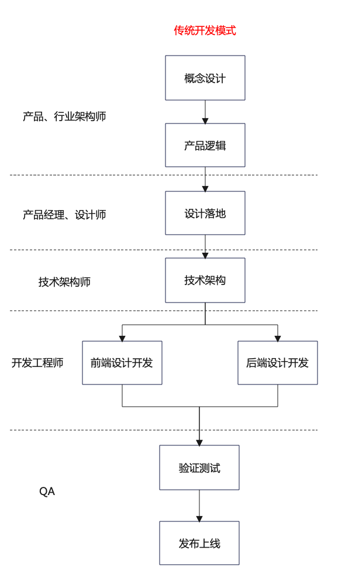
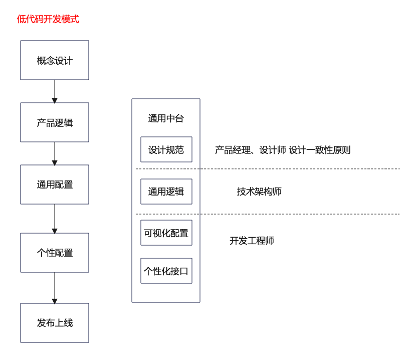
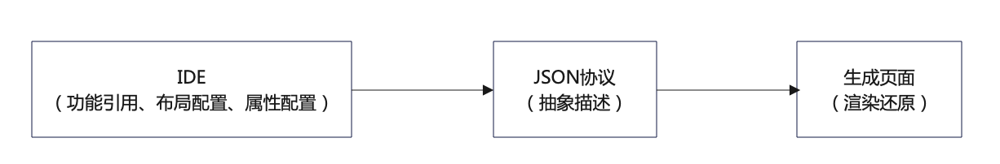
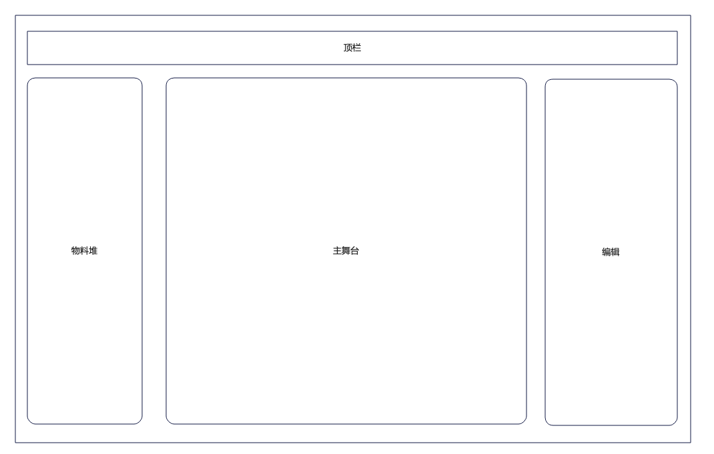
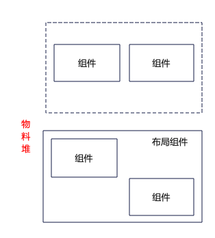
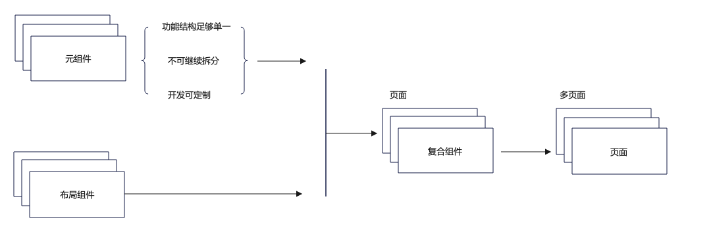
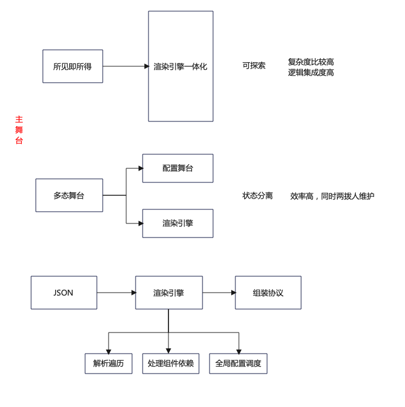

# 低代码

## 一、什么是低代码？

### 低代码开发平台（LCDP: DO MORE WITH LESS）

本质： 软件

区别：IDE => 可视化配置页面

Low的是-代码量

High的是-高复用、高效率、易维护&逻辑可控

### 场景：

门户首页、活动页面、营销页面

链接：https://powerapps.microsoft.com/zh-cn/what-is-low-code/#

### 核心能力 or 基本点：

* 可视化配置面板
* 拓展能力 - 组件、模板、逻辑复用
* 生命周期管理 - 开发管理、页面管理、部署管理

### 开发流程转变

开发方式的改变 => 应用模式的改变 => 开发流程的改变

## 二、模式-低代码的开发模式转变

角色转变：

* 产品 & 设计师: 单个割裂app的设计 => 通用规范 or 行业领域的设计

* 技术专家 & 开发: 单个page的开发 => 领域模型的抽象、设计、开发

* QA: 页面测试机器 => 规范 & 通用逻辑的守门员

以下是采用传统开发模式的一个简单梳理：

下面是采用低代码开发模式的一个简单梳理：

由此可见，低代码开发模式会更为简单

## 三、分类-低代码的兄弟姐妹们

### Low code

1. 预置组件实现全集功能
2. 可视化配置降低开发门槛
3. 支持定制 & 拓展

### No Code

1. 完成可视化配置
2. 不支持拓展，一切需求规范化

### Pre Code

1. 组件化抽象
2. 框架层规范 - Vue React

## 四、原理

### 三大核心点

1. 页面管理

2. 配置页面

  * 组件库（物料堆）
  * 配置画布（舞台）
  * 配置项 （配置面板）
  * 顶栏（全局 / 页面配置）

3. 输出页面

简单流程如下图所示：

我们在IDE上面进行编码，写好应用的功能，布局，组件的属性配置等，然后保存的时候，把我们的所有东西生成为一个JSON字段，最后，页面通过读取JSON字段里面的内容，渲染出来页面。

#### 业界产品

宜搭（阿里云）
sula（蚂蚁）
乐高（美团）

## 五、低代码的架构设计

一个由低代码构成的页面，主要包括四大部分，包括顶栏、物料堆，主舞台和编辑区域，大致布局如下所示：

我们具体来看一下，这三大部分主要做了哪些内容？

* 物料抽象堆：需要后续组件完成时，直接丢入物料堆即可被加载，无需后续调整物料堆代码。
* 主舞台：解析json，响应好加载物料堆中的组件进行渲染。
* 编辑区：点击渲染好的页面某一块，点击组件树可以拿到相应的vue实例或者VNode实例，并且拿到挂载在node上的config

物料堆结构如下所示：

其中：物料堆主要是有组件组成，各个组件构成了复合组件，复合组件又形成了页面，所以就构成了物料堆的主要内容。

组件复合组件和页面如下所示：

主舞台结构如下所示：

看图可以知道，主舞台有两种方式，一种是渲染一体化，另一种是讲主舞台分为了配置舞台和渲染引擎两部分

编辑区域分析

* 相同类型使用同一种控制面板，不同类型的组件控制面板不同
* 单个类型的组件，每一个组件可以设置不同的值
* config 应该挂载在 vnode 上面

### 执行时方案

## 五、基础框架设计